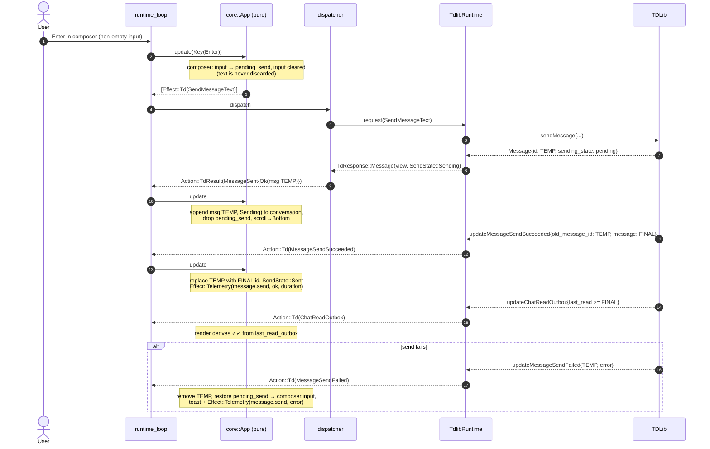

# telegram-tui — architecture

**Status:** Approved for implementation
**Derived from:** `docs/superpowers/specs/2026-07-30-telegram-tui-design.md` (authoritative for product behavior)
**Companion:** `docs/plan.md` (task decomposition for parallel subagent execution)

This document is the as-built-to-be architecture. Type definitions here are the
contract between tasks in the plan: a task implements exactly these signatures,
and a task that needs a neighbor's type reads it from here, not from the
neighbor's diff.

---

## 1. Crate graph

```
tgt-core  ──────────►  (tokio/sync, serde, thiserror, nucleo, hmac)
   ▲    ▲
   │    │
tgt-ui ─┘ ──────────►  (ratatui, crossterm, unicode-*, lru, qrcode, ratatui-image)
   ▲
   │
tgt-app ────────────►  (tdlib-rs, tracing-batteries, keyring, clap, color-eyre)
```

| Package | Lib/bin name | Role |
|---|---|---|
| `tgt-core` (`crates/core`) | `tgt_core` | Domain model, `AppState`, pure `update()`, TDLib boundary types, `TdRuntime` trait, `FakeTd`, telemetry schema and `emit!` |
| `tgt-ui` (`crates/ui`) | `tgt_ui` | ratatui views, message layout engine, layout cache, theme, crossterm→`Key` input mapping |
| `tgt-app` (`crates/app`) | binary `tgt` | Composition root: config, CLI, main loop, `Effect` dispatcher, `TdlibRuntime`, logging/OTLP wiring, Keychain, packaging glue |

Enforced boundaries (CI script `scripts/check-crate-boundaries.sh`, see §9.1):

- `tgt-core` must not depend on `ratatui` or `crossterm`.
- `tgt-ui` must not depend on `tdlib-rs`.

`tgt-ui` consumes only plain data re-exported from `tgt_core`.

## 2. Module map

Every module, its path, and its single responsibility. Files are deliberately
small; a module that outgrows ~300 lines is a candidate for splitting before it
is a candidate for editing.

### 2.1 `crates/core/src/`

| Path | Responsibility |
|---|---|
| `lib.rs` | Module tree and public re-exports; no logic |
| `action.rs` | The `Action` enum: every input to `update()` |
| `effect.rs` | The `Effect` enum: every side effect `update()` may request |
| `app.rs` | `App` root: owns `AppState`, routes actions (modal → focused pane → global), dirty flag |
| `model/ids.rs` | Newtype ids: `ChatId`, `MessageId`, `UserId`, `FileId` |
| `model/message.rs` | `MessageView`, `MessageContent`, `SendState`, `MessageCaps`, `ReactionView`, `ReplyPreview` |
| `model/chat.rs` | `ChatView`, `ChatKind`, `ChatListId`, `ChatPositionEntry`, `MessagePreview` |
| `model/entity.rs` | `FormattedText`, `TextEntity`, `EntityKind` (UTF-16 offsets, unconverted) |
| `model/chips.rs` | `Chip` enum and `chips_for(caps, is_outgoing) -> Vec<Chip>` derivation from TDLib flags |
| `model/key.rs` | Terminal-agnostic `Key` enum and `KeyBindings` |
| `model/time.rs` | `Millis` monotonic timestamp (injected via `Action::Tick`) |
| `state/focus.rs` | `Focus`, `ModalKind`, `FocusStack` (push/pop; `Esc` pops exactly one) |
| `state/auth.rs` | Projection of `AuthPhase` into wizard fields, inline errors, flood-wait countdown |
| `state/consent.rs` | First-run telemetry consent screen state |
| `state/chat_list.rs` | Chat map plus per-list `BTreeSet<ChatOrderKey>` mirroring TDLib order; selection, filter |
| `state/conversation.rs` | Per-chat message window, scroll anchor, window eviction, read markers |
| `state/history.rs` | `PagingState` machine (`Idle`/`Loading`/`Cooldown`/`Exhausted`) and its transitions |
| `state/selection.rs` | Selection mode: selected message, chip cursor, chip invocation → effects |
| `state/composer.rs` | Input buffer, reply/edit context, `pending_send` (text held until send confirmed), bare-path detection |
| `state/modal.rs` | Modal lifecycle: confirm-delete, send-file; confirmation → effects |
| `state/palette.rs` | `ctrl+p` palette: nucleo fuzzy match over chats and commands |
| `state/search.rs` | In-chat search: query, hit list, `n`/`N` stepping |
| `state/toasts.rs` | Toast queue (max 3, 4 s TTL), mute/focused-chat suppression, chat-less notifications |
| `state/media.rs` | `FileSnapshot` table, download/upload progress, viewport-priority derivation |
| `state/presence.rs` | Typing indicators (with expiry) and user online status |
| `td/runtime.rs` | `TdRuntime` trait |
| `td/request.rs` | `TdRequest`, `TdResponse`, `TdlibParams` |
| `td/update.rs` | `TdUpdate`, `AuthPhase`, `ConnectionPhase` (pre-digested, serde-serializable) |
| `td/error.rs` | `TdError` with named variants (`FloodWait` etc.) |
| `td/fake.rs` | `FakeTd`: JSONL fixture replay, request matching, received-request log |
| `telemetry/mod.rs` | `TelemetryEvent`, `Outcome`, builder constructors |
| `telemetry/schema.rs` | Allowlisted event/attribute constants; `ALLOWED_KEYS` |
| `telemetry/emit.rs` | The `emit!` macro: sole path to the exporter, sets `telemetry.public = true` |
| `telemetry/hashing.rs` | `hash_id(salt, id) -> String`: HMAC-SHA256 truncated to 8 bytes, hex |

### 2.2 `crates/ui/src/`

| Path | Responsibility |
|---|---|
| `lib.rs` | Module tree; `pub fn view(state: &AppState, theme: &Theme, f: &mut Frame, cache: &mut LayoutCache)` root |
| `theme/mod.rs` | `Theme` struct (semantic tokens only), default theme, sender-color derivation |
| `theme/loader.rs` | TOML theme file parsing, truecolor→256 degradation |
| `input/mod.rs` | Mechanical `crossterm::event::Event` → `Option<Action>` conversion (no routing logic) |
| `view/root.rs` | Responsive arrangement: two-pane ≥ breakpoint, single-pane stack below; breadcrumb header |
| `view/chat_list.rs` | Sidebar: rows, badges, pinned section, archive pseudo-row, folder tabs |
| `view/conversation.rs` | Message list viewport: consumes cached layouts, scroll, selection highlight, search-hit highlight |
| `view/header.rs` | Chat header: title, presence, typing, connection state indicator |
| `view/composer.rs` | Input box, reply/edit banner, upload progress |
| `view/chips.rs` | Action chip row with horizontal scroll affordances |
| `view/hint_bar.rs` | Bottom hint bar (context-dependent key hints) |
| `view/modal.rs` | Centered modal rendering (confirm delete, send file) |
| `view/toast.rs` | Lower-right toast stack |
| `view/palette.rs` | Centered command palette |
| `view/auth.rs` | Auth wizard screens: credentials, method choice, phone/code/password, QR (Unicode half-blocks) |
| `view/consent.rs` | Telemetry consent screen |
| `view/help.rs` | `?` help overlay |
| `render/offsets.rs` | **Isolated pure function**: UTF-16 code-unit span → byte range (constraint 5) |
| `render/wrap.rs` | Grapheme-aware, width-aware span wrapping (`unicode-segmentation` + `unicode-width`) |
| `render/message_layout.rs` | `layout_message()`: entities → styled spans → wrapped `Line`s; rails, grouping, quotes, spoilers, file cards |
| `render/cache.rs` | `LayoutCache`: LRU bounded by total line count, wholesale clear on width/theme change |
| `render/image.rs` | Inline image cells via `ratatui-image`; scroll invalidation; placeholder fallback |

### 2.3 `crates/app/src/`

| Path | Responsibility |
|---|---|
| `main.rs` | Entry: CLI parse, config load, panic hook, consent gating, terminal setup/teardown |
| `cli.rs` | `clap` definitions: `tgt`, `--no-telemetry`, `tgt telemetry show|reset-id` |
| `config.rs` | TOML config load/generate (`etcetera` paths), unknown-key warnings, the retired-key refusal (§4.4.3), `ConfigPatch` application, the fatal-write error |
| `keychain.rs` | 32-byte DB encryption key via `keyring` (macOS Keychain); generate-on-first-run |
| `runtime_loop.rs` | The `tokio::select!` main loop: action channel, terminal events, tick, coalesced draw, fatal-error return |
| `dispatch.rs` | `Effect` → async execution; completion re-enters as `Action::TdResult`/`Action::Io` |
| `td_runtime.rs` | `TdlibRuntime`: tdlib-rs client, `spawn_blocking` receive loop, type mapping both directions |
| `graphics.rs` | Terminal graphics protocol probe at startup (kitty/iterm2/sixel/none) |
| `media_kind.rs` | Path/extension → `OutgoingFileKind` |
| `notify.rs` | `OSC 777` / `BEL` emission; generic body only, structurally no payload |
| `logging.rs` | Rolling file log under `~/.local/state/telegram-tui/`; nothing to stdout/stderr while TUI active |
| `otel.rs` | OTLP exporter (opt-in), public-marker filter layer, 2 s shutdown timeout |
| `crash.rs` | `tracing-batteries` Sentry session, breadcrumbs, fatal-error capture, 2 s flush |
| `telemetry_cli.rs` | `telemetry show` / `reset-id` implementations |
| `panic.rs` | Panic hook: leave alternate screen and raw mode before printing |
| `build.rs` | macOS rpath link args and dev-time dylib copy (§9.2) |

---

## 3. Runtime data flow

The Elm architecture over one `tokio::sync::mpsc` channel. One owner of state,
no locks, no `Arc<RwLock<_>>`.

```rust
// crates/app/src/runtime_loop.rs (shape; exact code lives there)
loop {
    tokio::select! {
        Some(action) = actions.recv() => effects.extend(app.update(action)),
        Some(ev) = term_events.next() => {
            if let Some(action) = tgt_ui::input::map_event(ev?) {
                effects.extend(app.update(action));
            }
        }
        _ = tick.tick() => effects.extend(app.update(Action::Tick { now: clock.now() })),
    }
    for eff in effects.drain(..) {
        dispatcher.dispatch(eff); // spawns; completions come back as Actions
    }
    if app.take_dirty() && draw_gate.ready() /* ≥16 ms since last draw */ {
        terminal.draw(|f| tgt_ui::view(app.state(), &theme, f, &mut cache))?;
    }
}
```

- `update()` is pure: no I/O, no spawning, no clock/RNG reads. Time arrives via
  `Action::Tick { now }` and is cached in `AppState.now`; randomness is never
  needed inside `update()` (install id and HMAC salt are generated in
  `tgt-app` at boot and passed in as plain data).
- TDLib updates are pre-digested by the runtime into `TdUpdate` (a serde-able
  domain enum) before entering the channel as `Action::Td(_)`.
- `Effect` dispatch completions re-enter the channel as domain-specific
  completion actions (`Action::TdResult`, `Action::Io`) carrying
  `Result<_, TdError>`; the dispatcher never handles errors itself beyond
  logging locally.
- Rendering is dirty-flag driven; a 16 ms gate coalesces draw bursts.
  Resize events invalidate the layout cache and force a full redraw.

---

## 4. Load-bearing types

All code below is real Rust and compiles as written given the listed imports.
Tasks must not rename fields or variants without updating this document first.

### 4.1 Ids and primitives — `core/src/model/ids.rs`, `model/time.rs`, `model/key.rs`

```rust
use serde::{Deserialize, Serialize};

#[derive(Debug, Clone, Copy, PartialEq, Eq, PartialOrd, Ord, Hash, Serialize, Deserialize)]
pub struct ChatId(pub i64);

#[derive(Debug, Clone, Copy, PartialEq, Eq, PartialOrd, Ord, Hash, Serialize, Deserialize)]
pub struct MessageId(pub i64);

#[derive(Debug, Clone, Copy, PartialEq, Eq, PartialOrd, Ord, Hash, Serialize, Deserialize)]
pub struct UserId(pub i64);

#[derive(Debug, Clone, Copy, PartialEq, Eq, PartialOrd, Ord, Hash, Serialize, Deserialize)]
pub struct FileId(pub i32);

/// Monotonic milliseconds since process start. Injected via `Action::Tick`;
/// `update()` never reads a clock.
#[derive(Debug, Clone, Copy, Default, PartialEq, Eq, PartialOrd, Ord, Serialize, Deserialize)]
pub struct Millis(pub u64);

impl Millis {
    pub fn saturating_add(self, ms: u64) -> Millis { Millis(self.0.saturating_add(ms)) }
}
```

```rust
// core/src/model/key.rs
use serde::{Deserialize, Serialize};

/// Terminal-agnostic key. `tgt-ui` converts crossterm events into this;
/// all routing happens inside `update()` against the focus stack, so focus
/// transitions are unit-testable without a terminal.
#[derive(Debug, Clone, Copy, PartialEq, Eq, Hash, Serialize, Deserialize)]
pub enum Key {
    Char(char),
    Enter,
    AltEnter,
    Esc,
    Tab,
    BackTab,
    Up,
    Down,
    Left,
    Right,
    Backspace,
    Delete,
    Home,
    End,
    PageUp,
    PageDown,
    Ctrl(char), // Ctrl('c'), Ctrl('p'), …
    // Pane movement (§6.2). Terminals that do not emit modified arrow
    // sequences (notably Apple Terminal.app) deliver these as plain
    // Left/Right instead.
    CtrlLeft,
    CtrlRight,
}

/// Rebindable global keys, parsed from config ("ctrl+p" → Key::Ctrl('p')).
#[derive(Debug, Clone, PartialEq, Eq)]
pub struct KeyBindings {
    pub palette: Key,
    pub help: Key,
    pub quit: Key,
}

impl Default for KeyBindings {
    fn default() -> Self {
        KeyBindings { palette: Key::Ctrl('p'), help: Key::Char('?'), quit: Key::Ctrl('c') }
    }
}
```

### 4.2 Message and chat model — `core/src/model/`

```rust
// core/src/model/entity.rs
use serde::{Deserialize, Serialize};

/// Offsets are UTF-16 code units exactly as Telegram delivers them.
/// Conversion to byte offsets happens in ONE place: `tgt_ui::render::offsets`.
#[derive(Debug, Clone, PartialEq, Eq, Serialize, Deserialize)]
pub struct FormattedText {
    pub text: String,
    pub entities: Vec<TextEntity>,
}

#[derive(Debug, Clone, PartialEq, Eq, Serialize, Deserialize)]
pub struct TextEntity {
    pub offset_utf16: u32,
    pub length_utf16: u32,
    pub kind: EntityKind,
}

#[derive(Debug, Clone, PartialEq, Eq, Serialize, Deserialize)]
pub enum EntityKind {
    Bold,
    Italic,
    Underline,
    Strikethrough,
    Spoiler,
    Code,
    Pre { language: Option<String> },
    Blockquote,
    TextUrl { url: String },
    Url,
    Mention,
    Hashtag,
}
```

```rust
// core/src/model/message.rs
use serde::{Deserialize, Serialize};
use std::path::PathBuf;
use crate::model::entity::FormattedText;
use crate::model::ids::{ChatId, FileId, MessageId, UserId};
use crate::td::error::TdError;

#[derive(Debug, Clone, PartialEq, Serialize, Deserialize)]
pub struct MessageView {
    pub id: MessageId,
    pub chat_id: ChatId,
    pub sender: Sender,
    pub sender_name: String,
    pub is_outgoing: bool,
    /// Unix seconds as delivered by TDLib. Formatting is a ui concern.
    pub date: i64,
    pub content: MessageContent,
    pub reply_to: Option<ReplyPreview>,
    pub send_state: SendState,
    pub reactions: Vec<ReactionView>,
    pub caps: MessageCaps,
    pub is_edited: bool,
}

#[derive(Debug, Clone, Copy, PartialEq, Eq, Hash, Serialize, Deserialize)]
pub enum Sender {
    User(UserId),
    Chat(ChatId), // channel posts, anonymous admins
}

impl Sender {
    /// Stable value for deterministic per-sender accent color derivation.
    pub fn color_seed(&self) -> i64 {
        match self { Sender::User(u) => u.0, Sender::Chat(c) => c.0 }
    }
}

#[derive(Debug, Clone, PartialEq, Serialize, Deserialize)]
pub enum MessageContent {
    Text(FormattedText),
    Photo { file_id: FileId, width: u32, height: u32, caption: FormattedText },
    Video { file_id: FileId, file_name: String, size: u64, duration_secs: u32, caption: FormattedText },
    Audio { file_id: FileId, file_name: String, size: u64, duration_secs: u32 },
    Document { file_id: FileId, file_name: String, size: u64, caption: FormattedText },
    Sticker { emoji: String },
    Unsupported { description: String },
}

#[derive(Debug, Clone, PartialEq, Serialize, Deserialize)]
pub enum SendState {
    /// Optimistic: appended from the sendMessage response (temporary id).
    Sending,
    /// Confirmed by updateMessageSendSucceeded (final id).
    Sent,
    Failed(TdError),
}
// "Read" (✓✓) is not a SendState: it is derived at render time from
// `ConversationState.last_read_outbox >= message.id`.

#[derive(Debug, Clone, PartialEq, Eq, Serialize, Deserialize)]
pub struct ReactionView {
    pub emoji: String,
    pub count: u32,
    pub chosen_by_me: bool,
}

#[derive(Debug, Clone, PartialEq, Eq, Serialize, Deserialize)]
pub struct ReplyPreview {
    pub message_id: MessageId,
    pub sender_name: String,
    /// Single line, pre-truncated by the runtime mapping layer.
    pub excerpt: String,
}

/// Mirrors TDLib's per-message capability flags verbatim. Chips derive from
/// these and are never hardcoded (spec §5.3).
#[derive(Debug, Clone, Copy, Default, PartialEq, Eq, Serialize, Deserialize)]
pub struct MessageCaps {
    pub can_be_edited: bool,
    pub can_be_deleted_for_all_users: bool,
    pub can_be_deleted_only_for_self: bool,
    pub can_be_forwarded: bool,
    pub can_be_saved: bool,
}

/// TDLib reports download and upload progress on the same `updateFile`,
/// from two different halves of it: `local.downloaded_size` and
/// `remote.uploaded_size`. Both are projected here, because an outgoing
/// message's progress bar has no other source (T68).
#[derive(Debug, Clone, PartialEq, Serialize, Deserialize)]
pub struct FileSnapshot {
    pub id: FileId,
    pub expected_size: u64,
    pub downloaded_size: u64,
    /// Bytes TDLib has uploaded so far, from `file.remote.uploaded_size`.
    /// Zero for anything that is not being sent.
    pub uploaded_size: u64,
    pub is_downloading: bool,
    pub is_completed: bool,
    pub local_path: Option<PathBuf>,
}
```

```rust
// core/src/model/chat.rs
use serde::{Deserialize, Serialize};
use crate::model::ids::ChatId;

#[derive(Debug, Clone, Copy, PartialEq, Eq, Serialize, Deserialize)]
pub enum ChatKind { Private, Group, Supergroup, Channel }

impl ChatKind {
    /// Allowlisted telemetry value (`chat.kind`).
    pub fn telemetry_str(self) -> &'static str {
        match self {
            ChatKind::Private => "private",
            ChatKind::Group => "group",
            ChatKind::Supergroup => "supergroup",
            ChatKind::Channel => "channel",
        }
    }
}

#[derive(Debug, Clone, Copy, PartialEq, Eq, Hash, Serialize, Deserialize)]
pub enum ChatListId {
    Main,
    Archive,
    Folder(i32),
}

/// A `ChatFolderInfo`'s title, keyed by the same id `ChatListId::Folder`
/// names (task #60). Icon, color and sharing flags are TDLib fields this
/// client doesn't render.
#[derive(Debug, Clone, PartialEq, Eq, Serialize, Deserialize)]
pub struct FolderInfo {
    pub id: i32,
    pub title: String,
}

#[derive(Debug, Clone, Copy, PartialEq, Eq, Serialize, Deserialize)]
pub struct ChatPositionEntry {
    pub list: ChatListId,
    /// TDLib's order. 0 means "remove from this list". NEVER computed locally.
    pub order: i64,
    pub is_pinned: bool,
}

#[derive(Debug, Clone, PartialEq, Serialize, Deserialize)]
pub struct ChatView {
    pub id: ChatId,
    pub kind: ChatKind,
    pub title: String,
    pub positions: Vec<ChatPositionEntry>,
    pub unread_count: u32,
    pub unread_mention_count: u32,
    pub last_message: Option<MessagePreview>,
    pub is_muted: bool,
}

#[derive(Debug, Clone, PartialEq, Serialize, Deserialize)]
pub struct MessagePreview {
    pub sender_name: String,
    pub text: String,
    pub date: i64,
    pub is_outgoing: bool,
}

/// Sort key mirroring TDLib: (order DESC, chat_id DESC).
#[derive(Debug, Clone, Copy, PartialEq, Eq)]
pub struct ChatOrderKey {
    pub order: i64,
    pub chat_id: ChatId,
}

impl Ord for ChatOrderKey {
    fn cmp(&self, other: &Self) -> std::cmp::Ordering {
        other.order.cmp(&self.order).then(other.chat_id.cmp(&self.chat_id))
    }
}
impl PartialOrd for ChatOrderKey {
    fn partial_cmp(&self, other: &Self) -> Option<std::cmp::Ordering> { Some(self.cmp(other)) }
}
```

```rust
// core/src/model/chips.rs
use crate::model::message::MessageCaps;

#[derive(Debug, Clone, Copy, PartialEq, Eq)]
pub enum Chip {
    Reply,    // 'r'
    Forward,  // 'f'
    React,    // 'e'
    Copy,     // 'c'
    Edit,     // 'd'  (only own editable messages)
    Delete,   // 'x'
    Download, // 'l'  (file content, not yet downloaded)
    Open,     // 'o'  (file content, downloaded)
    Resend,   // 's'  (only SendState::Failed)
}

impl Chip {
    pub fn shortcut(self) -> char {
        match self {
            Chip::Reply => 'r', Chip::Forward => 'f', Chip::React => 'e',
            Chip::Copy => 'c', Chip::Edit => 'd', Chip::Delete => 'x',
            Chip::Download => 'l', Chip::Open => 'o', Chip::Resend => 's',
        }
    }
    pub fn label(self) -> &'static str {
        match self {
            Chip::Reply => "Reply", Chip::Forward => "Forward", Chip::React => "React",
            Chip::Copy => "Copy", Chip::Edit => "Edit", Chip::Delete => "Delete",
            Chip::Download => "Download", Chip::Open => "Open", Chip::Resend => "Resend",
        }
    }
}

/// Pure derivation from TDLib capability flags plus local message facts.
/// An action that would fail is never offered.
pub fn chips_for(
    caps: &MessageCaps,
    is_outgoing: bool,
    has_file: bool,
    file_downloaded: bool,
    send_failed: bool,
) -> Vec<Chip> {
    let mut chips = Vec::new();
    if send_failed {
        chips.push(Chip::Resend);
        chips.push(Chip::Delete);
        return chips;
    }
    chips.push(Chip::Reply);
    if caps.can_be_forwarded { chips.push(Chip::Forward); }
    chips.push(Chip::React);
    if caps.can_be_saved { chips.push(Chip::Copy); }
    if is_outgoing && caps.can_be_edited { chips.push(Chip::Edit); }
    if has_file && !file_downloaded { chips.push(Chip::Download); }
    if has_file && file_downloaded { chips.push(Chip::Open); }
    if caps.can_be_deleted_for_all_users || caps.can_be_deleted_only_for_self {
        chips.push(Chip::Delete);
    }
    chips
}
```

### 4.3 `Action` — `core/src/action.rs`

Decision: the top level is coarse (one variant per input source); each source
carries its own fine-grained enum. TDLib updates are pre-digested into
`TdUpdate` (not 1:1 raw TDLib types) so `core` never sees `tdlib-rs` types and
fixtures stay serde-serializable.

```rust
use std::path::PathBuf;
use crate::model::key::Key;
use crate::model::time::Millis;
use crate::td::update::TdUpdate;
use crate::td::error::TdError;
use crate::model::ids::{ChatId, FileId, MessageId};
use crate::model::message::{FileSnapshot, MessageCaps, MessageView};

#[derive(Debug, Clone)]
pub enum Action {
    /// A key press, unrouted. `update()` routes modal → focused pane → global.
    Key(Key),
    /// Bracketed paste (terminals paste dropped files as plain text paths).
    Paste(String),
    Resize { width: u16, height: u16 },
    /// Periodic housekeeping tick (250 ms). Carries injected time.
    Tick { now: Millis },
    /// Pre-digested TDLib push update.
    Td(TdUpdate),
    /// Completion of a dispatched `Effect::Td(_)` request.
    TdResult(TdResult),
    /// Completion of a dispatched non-TDLib effect.
    Io(IoResult),
    /// The TDLib client was replaced and everything the previous account
    /// left behind must go (§4.4.2). Emitted by `tgt-app` immediately
    /// before it swaps the runtime, because `update()` is pure and the app
    /// layer cannot clear `AppState` itself.
    ///
    /// Clears what belonged to the *account*: chats, conversations, open
    /// chat, media, presence, composer, selection, and any overlay standing
    /// on top of them. Keeps what belongs to the *session*: theme,
    /// bindings, telemetry mode and salt, consent, terminal size, clock —
    /// none of which the sign-out invalidates.
    AccountReset,
    /// Which messages the last drawn frame actually put on screen (§7.5).
    /// Like `Click`, the coordinates are resolved at the `tgt-ui` boundary —
    /// `update()` receives two message ids, never a `Rect`. Sent by
    /// `runtime_loop` after each draw, and only when the range changed.
    ///
    /// Deliberately does NOT set `dirty`: this action is produced *by*
    /// rendering, so marking it render-worthy would make every frame
    /// schedule another one.
    ViewportChanged { first: MessageId, last: MessageId },
}

/// Domain-specific completions: the dispatcher maps (request, response) pairs
/// into these mechanically. No correlation tokens; the domain context rides
/// along in the variant. (Judgment call, see architecture §8.)
#[derive(Debug, Clone)]
pub enum TdResult {
    /// Result of an auth submission (phone / code / password / QR request).
    AuthRequestDone { outcome: Result<(), TdError> },
    ChatsLoaded { outcome: Result<(), TdError> },
    HistoryLoaded {
        chat_id: ChatId,
        only_local: bool,
        outcome: Result<Vec<MessageView>, TdError>,
    },
    /// sendMessage returned: the optimistic message with its temporary id.
    MessageSent { chat_id: ChatId, outcome: Result<MessageView, TdError> },
    /// getMessageProperties completion: the selected message's capability
    /// flags (§7 — they do not ride on `message`). An `Err` leaves the
    /// message's existing caps in place.
    MessagePropertiesLoaded {
        chat_id: ChatId,
        message_id: MessageId,
        outcome: Result<MessageCaps, TdError>,
    },
    EditDone { chat_id: ChatId, message_id: MessageId, outcome: Result<(), TdError> },
    DeleteDone { chat_id: ChatId, outcome: Result<(), TdError> },
    ForwardDone { to_chat_id: ChatId, outcome: Result<(), TdError> },
    ReactionDone { chat_id: ChatId, message_id: MessageId, outcome: Result<(), TdError> },
    DownloadStarted { file_id: FileId, outcome: Result<FileSnapshot, TdError> },
    SearchDone {
        chat_id: ChatId,
        outcome: Result<Vec<MessageId>, TdError>,
    },
    LogOutDone { outcome: Result<(), TdError> },
}

#[derive(Debug, Clone)]
pub enum IoResult {
    ClipboardCopied { outcome: Result<(), IoErrorKind> },
    ExternalOpened { path: PathBuf, outcome: Result<(), IoErrorKind> },
    ConfigSaved { outcome: Result<(), IoErrorKind> },
}

#[derive(Debug, Clone, Copy, PartialEq, Eq)]
pub enum IoErrorKind { Denied, NotFound, Other }
```

### 4.4 `Effect` — `core/src/effect.rs`

```rust
use std::path::PathBuf;
use crate::td::request::TdRequest;
use crate::telemetry::TelemetryEvent;

#[derive(Debug, Clone)]
pub enum Effect {
    /// Execute a TDLib request. Completion re-enters as `Action::TdResult`.
    Td(TdRequest),
    /// Emit an allowlisted telemetry event (dispatcher calls `emit!`).
    Telemetry(TelemetryEvent),
    /// Ring the terminal: OSC 777 with a GENERIC body, or BEL fallback.
    /// Deliberately carries no payload — PII cannot ride on it structurally.
    Alert,
    CopyToClipboard { text: String },
    OpenExternal { path: PathBuf },
    SaveConfig(ConfigPatch),
    Quit,
}

/// The only config mutations `update()` may request.
///
/// No `TelemetryMode` variant, deliberately (T73). `ConsentAcknowledged`
/// carries the choice *and* the acknowledgement in one patch, so a Disable
/// persists instead of recording as "never answered" and re-prompting for
/// ever — which is what the earlier split produced.
#[derive(Debug, Clone, PartialEq)]
pub enum ConfigPatch {
    Theme(String),
    Credentials { api_id: i32, api_hash: String },
    ConsentAcknowledged { enabled: bool },
}

/// A master switch, not a destination: which egresses a session has is
/// decided in `tgt-app` from `[telemetry]` and from what was baked in at
/// build time (T73).
#[derive(Debug, Clone, Copy, PartialEq, Eq)]
pub enum TelemetryMode { On, Off }
```

### 4.4.1 A failed config write is fatal

`Effect::SaveConfig` persists things the app then behaves as if it has: the
api credentials the auth wizard just collected, the consent answer, the theme.
A write that fails silently leaves the session running against state that
exists only in memory, and in the credentials case it is worse than cosmetic —
`dispatch::save_config` only sends TDLib its parameters *after* a successful
write, so a failed one strands the client in `WaitTdlibParameters` with a login
screen that never proceeds and nothing on screen to explain why. So the write
failing ends the run, with a `human_errors::Error` that names the path and
what to do about it.

The path the error takes is the whole design:

```
dispatch::save_config          write fails; builds config::unwritable(path, cause)
  -> fatal_tx (mpsc, cap 1)    NOT printed here: the TUI still owns the screen
  -> runtime_loop step         Input::Fatal -> Step::Fatal, parked in Core::fatal
  -> runtime_loop::run         returns Err after the loop, drawing nothing
  -> run_tui                   TerminalGuard drops: raw mode off, screen restored
  -> crash::record_fatal_error downcast to human_errors::Error -> record_human_error
  -> main::report_to_user      prints err.message() to a usable shell, exit 1
```

Printing at the point of failure would put the message into cells the renderer
believes it owns, which is the exact failure an actionable message exists to
prevent. `main::report_to_user` bypasses `color_eyre` for this one error type,
because its `Location:` line is useful for a panic and noise for a user whose
config directory isn't writable.

**Load-bearing, for anyone softening this back to a toast:**
`state::auth::submit_credentials` advances the wizard and clears its field
error the moment both fields *parse*, before the write is dispatched, and it
never inspects the outcome. That optimistic advance is safe *only because* a
failed write ends the process. Turning this into a toast re-arms a session-long
stall in `WaitTdlibParameters` two files away — fix the wizard first.

### 4.4.2 Replacing a closed TDLib client

`authorizationStateClosed` is terminal for a TDLib client instance: nothing
more can be done with it and only a new client can get back to a usable
state. It is reached by `logOut` — which is the *only* legal way to abandon a
QR login, since TDLib refuses `setAuthenticationPhoneNumber` once a QR link
has been issued — and also whenever TDLib tears a client down on an
unrecoverable local error. `runtime_loop::Core::restart_client` handles both,
because it triggers on the phase rather than on "we asked to log out".

Two constraints shape it.

**The receive thread must be joined, not merely stopped.** `tdlib_rs::receive()`
reads the one global `td_receive` queue shared by every client in the process,
and our receive loop discards updates whose `@client_id` is not its own — there
is no way to put one back. Two threads therefore race for one queue and eat
each other's updates. `Drop` only asks the thread to stop and returns, leaving
it alive for up to one 2 s `receive()` timeout, which is exactly when the
replacement is being created; the dying thread can swallow the new client's
`WaitTdlibParameters`. So `TdlibRuntime::shutdown` joins, and the restart
awaits it before creating anything. Responses are unaffected: `@extra`
correlation goes through tdlib-rs's global `OBSERVER`, keyed by a counter
rather than by client.

**In-flight requests are abandoned deliberately.** `Dispatcher` carries a
generation counter, bumped by `replace_runtime`. Each spawned request captures
the generation it was issued under, and `Inner::deliver` drops the completion
if the generation has moved, with a debug line — a completion naming a chat
that no longer exists is the swallowed-completions bug in reverse, and a
silent drop would be the same bug again.

The restart drives the new client back through `WaitTdlibParameters`, which
arrives as an ordinary `TdUpdate`, so the dispatcher's existing
`send_tdlib_parameters` issues the request carrying the Keychain key. There is
no second copy of that path; `replace_runtime` only clears `params_pending` so
the deferred-issue path behaves as on a cold boot.

**It fires only pre-authorization, on purpose.** See `restart_client`'s doc
comment: chats load from exactly one place (`state::auth`'s `Ready` arm), so a
client that never authorized left no account-scoped state behind and replacing
it is complete on its own. A signed-in client that closes needs `AppState`
cleared first, which needs a core action that does not exist yet (task #64).
Restarting without it would render a signed-out user's chat list against a
fresh unauthenticated client.

### 4.4.3 A retired config key is refused, not ignored (0.2.0)

Unknown keys in `config.toml` produce a local `tracing::warn!` and are skipped,
so a file written by a newer binary does not brick an older one (spec §12).
`config::reject_retired_keys` is the one deliberate exception, and it runs in
`load()` *before* `parse` — a load carrying `[telemetry] mode` fails with a
`human_errors::Error` naming the file, the value found, and the key to write
instead.

The exception exists because the lenient rule inverts a user's answer here
rather than merely losing a preference. `mode = "off"` was an opt-out; treating
it as unknown yields `TelemetryMode::On` — measured, not assumed, by removing
the check and asserting on the result — so telemetry would start for someone
who had explicitly turned it off, recorded only in a log file they have no
reason to read. Every value is refused, not just `off`, because a diagnostic
that depends on the value cannot be predicted or documented, and `mode = "of"`
would otherwise read as consent.

Two placement details are load-bearing. The check sits in `load()` rather than
`parse` because `load` wraps `parse` in `with_context`, and eyre's
`downcast_ref` only inspects the outermost error — wrapped, the error would
reach `main::report_to_user` unrecognised and print as a generic report without
its advice. And `load()` is called before raw mode is entered, so this reuses
§4.4.1's abort path rather than introducing a second one.

### 4.5 Focus — `core/src/state/focus.rs`

```rust
use std::path::PathBuf;
use crate::model::ids::{ChatId, MessageId};

#[derive(Debug, Clone, PartialEq)]
pub enum Focus {
    ChatList,
    ChatFilter,
    Composer,
    /// Message selection mode (chips visible).
    Selection,
    ChatSearch,
    Palette,
    Help,
    Modal(ModalKind),
}

#[derive(Debug, Clone, PartialEq)]
pub enum ModalKind {
    ConfirmDelete { chat_id: ChatId, message_id: MessageId, can_revoke: bool },
    ConfirmSendFile { path: PathBuf },
}

/// Invariant: never empty. `Esc` pops exactly one level and never pops the base.
#[derive(Debug, Clone, PartialEq)]
pub struct FocusStack {
    stack: Vec<Focus>,
}

impl FocusStack {
    pub fn new(base: Focus) -> Self { FocusStack { stack: vec![base] } }
    pub fn current(&self) -> &Focus { self.stack.last().expect("focus stack never empty") }
    pub fn push(&mut self, f: Focus) { self.stack.push(f); }
    /// Pops one level; returns false (and does nothing) at the base.
    pub fn pop(&mut self) -> bool {
        if self.stack.len() > 1 { self.stack.pop(); true } else { false }
    }
    pub fn replace_base(&mut self, f: Focus) { self.stack[0] = f; }
    pub fn depth(&self) -> usize { self.stack.len() }
}
```

### 4.6 `AppState` and sub-states — `core/src/app.rs`, `core/src/state/`

Decision: sub-states are separate structs in separate modules, each with its own
handler functions; `App::update` is a thin router. This keeps file ownership
disjoint for parallel subagents and keeps every handler unit-testable in
isolation.

```rust
// core/src/app.rs
use std::collections::HashMap;
use crate::action::Action;
use crate::effect::{Effect, TelemetryMode};
use crate::model::ids::{ChatId, MessageId};
use crate::model::key::KeyBindings;
use crate::model::time::Millis;
use crate::state::auth::AuthState;
use crate::state::chat_list::ChatListState;
use crate::state::composer::ComposerState;
use crate::state::consent::ConsentState;
use crate::state::conversation::ConversationState;
use crate::state::focus::FocusStack;
use crate::state::media::MediaState;
use crate::state::modal::ModalState;
use crate::state::palette::PaletteState;
use crate::state::presence::PresenceState;
use crate::state::search::ChatSearchState;
use crate::state::toasts::ToastState;
use crate::td::update::ConnectionPhase;

#[derive(Debug, Clone, Copy, PartialEq, Eq)]
pub enum Screen { Consent, Auth, Main }

#[derive(Debug)]
pub struct AppState {
    pub screen: Screen,
    pub focus: FocusStack,
    pub connection: ConnectionPhase,
    pub consent: ConsentState,
    pub auth: AuthState,
    pub chat_list: ChatListState,
    pub conversations: HashMap<ChatId, ConversationState>,
    pub open_chat: Option<ChatId>,
    pub composer: ComposerState,
    /// Transient UI state (a cursor) of the modal named by `Focus::Modal(_)`;
    /// the modal's identity and parameters stay on the focus stack (§4.5).
    /// `Some` exactly while a modal is on top of the stack — the router
    /// creates it on push and drops it on pop, so the two cannot disagree.
    pub modal_ui: Option<ModalState>,
    pub palette: Option<PaletteState>,
    pub chat_search: Option<ChatSearchState>,
    pub toasts: ToastState,
    pub media: MediaState,
    pub presence: PresenceState,
    pub width: u16,
    pub height: u16,
    pub layout_breakpoint_cols: u16,
    pub theme_name: String,
    pub theme_generation: u64,
    pub bindings: KeyBindings,
    pub telemetry_mode: TelemetryMode,
    /// HMAC salt for hashed-id telemetry attributes. Generated in tgt-app.
    pub telemetry_salt: [u8; 32],
    /// Last observed tick time; the only "clock" update logic may consult.
    pub now: Millis,
    /// The oldest and newest message the last drawn frame put on screen, or
    /// `None` before the first frame and whenever no message was drawn.
    ///
    /// Read only by `state::selection`'s anchor policy. `None` means "no
    /// information", and every consumer must fall back to its pre-existing
    /// behavior — every unit and integration test in this workspace drives
    /// `update()` with no renderer attached, so `None` is the value they all
    /// see, and treating it as "everything is visible" would leave the suite
    /// green about a path no user reaches. Not render-affecting: it is
    /// produced by rendering, not consumed by it, so `Action::ViewportChanged`
    /// must never set `dirty`. Cleared whenever `open_chat` changes to a
    /// different chat — a stale range would suppress the first scroll in it.
    pub visible_messages: Option<(MessageId, MessageId)>,
}

/// Boot-time data computed impurely in tgt-app and injected as plain values.
#[derive(Debug, Clone)]
pub struct Boot {
    pub theme_name: String,
    pub bindings: KeyBindings,
    pub layout_breakpoint_cols: u16,
    pub telemetry_mode: TelemetryMode,
    pub telemetry_salt: [u8; 32],
    pub consent_needed: bool,
    pub has_credentials: bool,
    pub width: u16,
    pub height: u16,
}

#[derive(Debug)]
pub struct App {
    state: AppState,
    dirty: bool,
}

impl App {
    pub fn new(boot: Boot) -> Self;
    /// THE pure transition function. No I/O, no spawning, no clock, no RNG.
    pub fn update(&mut self, action: Action) -> Vec<Effect>;
    /// True once per render-worthy change; cleared on read.
    pub fn take_dirty(&mut self) -> bool;
    pub fn state(&self) -> &AppState;
}
```

Routing contract inside `App::update` (spec §6.2): keys go modal → focused pane
→ global; the first handler that claims the key stops propagation. Non-key
actions route by payload (e.g. `TdUpdate::ChatPosition` → `chat_list`,
`HistoryLoaded` → `history`/`conversation`). Every sub-state module exposes
plain functions; the canonical handler shapes are:

`move_pane_focus` (`app.rs`) runs the pane-movement row of that table:
`Key::CtrlLeft`/`Key::CtrlRight` move between `Focus::ChatList` and
`Focus::Composer` at depth 1, same as `Tab`/`BackTab`. `Focus::Selection` gets
the one exception above depth 1 — `Ctrl+←` there pops it and swaps the base to
`Focus::ChatList` in the same keystroke, since selection sits on the
conversation side and "go left" means the same thing there as in the
composer. Every other overlay (filter, search, palette, modal) keeps the
depth-1 gate. `Ctrl+→` from `Focus::ChatList` additionally opens the selected
chat, reusing `click_chat_row`'s bracket rather than a second open path.

```rust
// state/<name>.rs — handlers own their sub-struct, may read AppState context
pub fn handle_key(app: &mut AppState, key: Key) -> Option<Vec<Effect>>; // None = unclaimed
pub fn handle_td(app: &mut AppState, upd: &TdUpdate) -> Vec<Effect>;
pub fn handle_tick(app: &mut AppState, now: Millis) -> Vec<Effect>;
```

Sub-state definitions:

```rust
// core/src/state/consent.rs
#[derive(Debug, Clone, Copy, PartialEq, Eq)]
pub enum ConsentChoice { Enable, Disable }

#[derive(Debug, Clone, Copy, PartialEq, Eq)]
pub struct ConsentState {
    pub selected: ConsentChoice, // Enable preselected (spec §13.5)
    pub acknowledged: bool,
}
```

```rust
// core/src/state/auth.rs
use crate::model::time::Millis;
use crate::td::error::TdError;
use crate::td::update::AuthPhase;

/// The auth screen defaults to QR: arriving at `WaitPhoneNumber` fires
/// `RequestQrCodeAuthentication` immediately, guarded by `method.is_none()`
/// so it can't refire on TDLib's repeat `updateAuthorizationState`s (T77).
/// `PhoneSelected` is the arrow-highlighted-but-unconfirmed "sign in with
/// phone number instead" affordance shown under the QR; `Phone` is that
/// same escape hatch confirmed with Enter. Submitting from `Phone` while
/// TDLib is already past `WaitPhoneNumber` cannot call
/// `SetAuthenticationPhoneNumber` — TDLib's `AuthManager` rejects it once
/// `WaitOtherDeviceConfirmation` has been entered — so it calls `LogOut`
/// instead and relies on a TDLib client restart, not yet built in
/// `tgt-app`, to get back to a fresh `WaitPhoneNumber` (§9.2).
#[derive(Debug, Clone, Copy, PartialEq, Eq)]
pub enum LoginMethod { Qr, PhoneSelected, Phone }

#[derive(Debug, Clone, Default, PartialEq, Eq)]
pub struct InputField {
    pub text: String,
    /// Byte offset into `text`, always on a char boundary.
    pub cursor: usize,
}

#[derive(Debug, Clone, Copy, PartialEq, Eq)]
pub enum AuthField { ApiId, ApiHash, Phone, Code, Password }

#[derive(Debug, Clone, PartialEq)]
pub struct FieldError {
    pub field: AuthField,
    pub error: TdError,
}

/// Credentials-wizard contract (T11, binding on T12/T14): the wizard adds NO
/// fields anywhere — it is driven entirely by `active_field`. The AppState
/// constructor seeds `active_field = AuthField::ApiId` iff credentials are
/// missing (else `Phone`); `handle_key` treats `active_field ∈ {ApiId,
/// ApiHash}` as wizard-active regardless of phase; Enter on ApiHash (api_id
/// parses as i32, api_hash non-empty) emits
/// `Effect::SaveConfig(ConfigPatch::Credentials)` and moves to `Phone`.
/// Nothing may route back into ApiId/ApiHash once a phase past
/// WaitTdlibParameters has been projected.
///
/// A PROJECTION of TDLib's authorizationState — never a parallel state machine.
#[derive(Debug, Clone, PartialEq)]
pub struct AuthState {
    pub phase: AuthPhase,
    pub method: Option<LoginMethod>,
    pub api_id: InputField,
    pub api_hash: InputField,
    pub phone: InputField,
    pub code: InputField,
    pub password: InputField,
    pub active_field: AuthField,
    pub field_error: Option<FieldError>,
    /// FLOOD_WAIT rendered as a live countdown against `AppState.now`.
    pub flood_wait_until: Option<Millis>,
    pub in_flight: bool,
}
```

```rust
// core/src/state/chat_list.rs
use std::collections::{BTreeSet, HashMap};
use crate::model::chat::{ChatListId, ChatOrderKey, ChatView};
use crate::model::ids::ChatId;
use crate::state::auth::InputField;

#[derive(Debug, Clone, Copy, PartialEq, Eq)]
pub enum ChatLoadPhase { Idle, Loading, Complete }

#[derive(Debug, Default)]
pub struct ChatListState {
    pub chats: HashMap<ChatId, ChatView>,
    /// One TDLib-mirrored order set per chat list. Never computed locally.
    pub orders: HashMap<ChatListId, BTreeSet<ChatOrderKey>>,
    pub active_list: ChatListId,
    pub selected: Option<ChatId>,
    pub filter: Option<InputField>,
    pub scroll_offset: usize,
    pub load: ChatLoadPhase,
    /// `ChatListId::Folder`'s id -> title, from `updateChatFolders` (task
    /// #60). Replaced wholesale on every update — TDLib always sends the
    /// complete set, never a delta — so a rename or a deletion can't leave a
    /// stale entry. An id with no entry (not yet named, or genuinely
    /// unknown) is not an error: `view::chat_list`'s `folder_label` falls
    /// back to the bare id.
    pub folder_titles: HashMap<i32, String>,
}

impl Default for ChatListId {
    fn default() -> Self { ChatListId::Main }
}
```

```rust
// core/src/state/history.rs — the paging machine, freestanding and pure.
use crate::model::ids::MessageId;
use crate::model::time::Millis;

pub const PAGE_SIZE: u8 = 50;
/// Trigger paging when the scroll anchor is within this many MESSAGES of the
/// oldest loaded one (core counts messages, not rows: rows are a ui concept).
pub const PAGE_TRIGGER_MESSAGES: usize = 20;
/// An empty response is NOT end-of-history (spec §5.2): retry with
/// only_local = false up to this bound before believing TDLib.
pub const MAX_EMPTY_ATTEMPTS: u8 = 3;

#[derive(Debug, Clone, Copy, PartialEq, Eq)]
pub enum PagingState {
    Idle,
    Loading { attempt: u8, only_local: bool },
    /// FloodWait or transient error: no requests until `until`.
    Cooldown { until: Millis },
    /// Only entered when a non-local request came back empty at max attempts.
    Exhausted,
}

/// What the caller (conversation.rs) must do after feeding an event in.
#[derive(Debug, Clone, PartialEq, Eq)]
pub enum PagingDirective {
    None,
    /// Issue Effect::Td(GetChatHistory { from_message_id, limit: PAGE_SIZE, only_local }).
    Request { from_message_id: MessageId, only_local: bool },
}

pub fn on_scroll_near_top(
    paging: &mut PagingState,
    oldest_loaded: Option<MessageId>,
    now: Millis,
) -> PagingDirective;

pub fn on_history_loaded(
    paging: &mut PagingState,
    received: usize,
    was_only_local: bool,
    oldest_loaded: Option<MessageId>,
) -> PagingDirective;

pub fn on_history_error(paging: &mut PagingState, retry_after: Option<u32>, now: Millis);
```

```rust
// core/src/state/conversation.rs
use std::collections::{BTreeSet, VecDeque};
use crate::model::ids::{ChatId, MessageId};
use crate::model::message::MessageView;
use crate::state::history::PagingState;

/// Bounded loaded window: memory stays flat in long-lived sessions.
pub const WINDOW_MAX_MESSAGES: usize = 500;

#[derive(Debug, Clone, Copy, PartialEq, Eq)]
pub enum Scroll {
    /// Pinned to newest; new messages keep the view at the bottom.
    Bottom,
    /// Anchored at a message (stable across prepends), offset in laid-out lines.
    At { message_id: MessageId, line_offset: u16 },
}

#[derive(Debug)]
pub struct ConversationState {
    pub chat_id: ChatId,
    /// Ascending by message id; prepend on page, append on new message.
    pub messages: VecDeque<MessageView>,
    pub paging: PagingState,
    pub scroll: Scroll,
    pub revealed_spoilers: BTreeSet<MessageId>,
    pub last_read_inbox: MessageId,
    pub last_read_outbox: MessageId,
    /// Storm control for the `ViewMessages` request that marks messages read
    /// (T72). A watermark plus an expiry, not a plain in-flight flag:
    /// `viewMessages` is fire-and-forget, so nothing comes back to clear a
    /// flag and a dropped request would otherwise wedge the chat unread.
    pub pending_view: Option<PendingView>,
    /// In-chat search hits (populated by state/search.rs).
    pub search_hits: Vec<MessageId>,
}
```

```rust
// core/src/state/selection.rs
use crate::model::chips::Chip;
use crate::model::ids::MessageId;

#[derive(Debug, Clone, PartialEq)]
pub struct SelectionState {
    pub message_id: MessageId,
    /// Chips recomputed from caps whenever the selected message changes.
    pub chips: Vec<Chip>,
    pub chip_cursor: usize,
    /// First visible chip index (horizontal chip scrolling, ‹ › affordances).
    pub chip_scroll: usize,
}
```

Selection is per open chat and transient, so it lives on the conversation it
selects in: `ConversationState` gains
`pub selection: Option<SelectionState>` in milestone 4 (task T26). The field is
listed here so neighboring tasks can rely on the name.

```rust
// core/src/state/composer.rs
use std::path::PathBuf;
use crate::model::ids::MessageId;
use crate::state::auth::InputField;

#[derive(Debug, Default)]
pub struct ComposerState {
    /// Multi-line buffer; `alt+enter` inserts '\n'.
    pub input: InputField,
    pub reply_to: Option<MessageId>,
    /// When set, Enter submits an edit instead of a send.
    pub editing: Option<MessageId>,
    /// Text held while a send is in flight. Restored to `input` on failure
    /// (spec §14: send failures never discard typed text).
    pub pending_send: Option<String>,
    /// A pasted bare path that exists on disk: offer to send as file.
    pub pending_path_offer: Option<PathBuf>,
}
```

```rust
// core/src/state/palette.rs
use crate::model::ids::ChatId;
use crate::state::auth::InputField;

#[derive(Debug, Clone, Copy, PartialEq, Eq)]
pub enum CommandId { ToggleTheme, TelemetrySettings, SendFile, LogOut, Quit }

#[derive(Debug, Clone, PartialEq)]
pub enum PaletteItem {
    Chat { id: ChatId, score: u32 },
    Command { id: CommandId, score: u32 },
}

#[derive(Debug)]
pub struct PaletteState {
    pub input: InputField,
    /// Ranked by nucleo match score, then chat recency (TDLib order).
    pub results: Vec<PaletteItem>,
    pub selected: usize,
}
```

```rust
// core/src/state/search.rs
use crate::state::auth::InputField;

#[derive(Debug, Default)]
pub struct ChatSearchState {
    pub input: InputField,
    /// Index into ConversationState.search_hits ('n'/'N' step).
    pub current_hit: usize,
    pub in_flight: bool,
}
```

```rust
// core/src/state/toasts.rs
use std::collections::VecDeque;
use crate::model::ids::ChatId;
use crate::model::time::Millis;

pub const TOAST_MAX: usize = 3;
pub const TOAST_TTL_MS: u64 = 4_000;

/// In-app only: title/body may contain chat titles and message text because
/// they never leave the terminal cell grid. Effect::Alert (the escape-sequence
/// path) carries no payload at all.
///
/// `chat_id` is `None` for a notification with no chat to point at — a
/// failed logout, a failed "open externally" — raised through
/// `on_chatless_failure` rather than `on_new_message`/`on_action_failed`.
/// `view/toast.rs` never reads this field either way; it's reserved for a
/// future click-to-jump.
#[derive(Debug, Clone, PartialEq)]
pub struct Toast {
    pub chat_id: Option<ChatId>,
    pub title: String,
    pub body: String,
    pub expires_at: Millis,
}

#[derive(Debug, Default)]
pub struct ToastState {
    pub toasts: VecDeque<Toast>,
}
```

```rust
// core/src/state/media.rs
use std::collections::HashMap;
use crate::model::ids::{ChatId, FileId, MessageId};
use crate::model::message::FileSnapshot;

#[derive(Debug, Default)]
pub struct MediaState {
    pub files: HashMap<FileId, FileSnapshot>,
    /// Outgoing uploads keyed by the optimistic message id.
    pub uploads: HashMap<MessageId, UploadProgress>,
}

#[derive(Debug, Clone, Copy, PartialEq)]
pub struct UploadProgress {
    pub chat_id: ChatId,
    pub uploaded: u64,
    pub total: u64,
}
```

```rust
// core/src/state/presence.rs
use std::collections::HashMap;
use crate::model::ids::{ChatId, UserId};
use crate::model::time::Millis;
use crate::td::update::PresenceStatus;

pub const TYPING_TTL_MS: u64 = 6_000;

#[derive(Debug, Default)]
pub struct PresenceState {
    pub users: HashMap<UserId, PresenceStatus>,
    /// (chat, user) → expiry; swept on Tick.
    pub typing: HashMap<(ChatId, UserId), Millis>,
}
```

### 4.7 TDLib boundary — `core/src/td/`

```rust
// core/src/td/runtime.rs
use async_trait::async_trait;
use tokio::sync::mpsc;
use crate::td::error::TdError;
use crate::td::request::{TdRequest, TdResponse};
use crate::td::update::TdUpdate;

#[async_trait]
pub trait TdRuntime: Send + Sync + 'static {
    async fn request(&self, req: TdRequest) -> Result<TdResponse, TdError>;
    /// Called exactly once by the runtime loop at boot; panics on second call.
    fn updates(&self) -> mpsc::Receiver<TdUpdate>;
}
```

**`TdlibRuntime` (`crates/app/src/td_runtime.rs`)** — the only module in the
workspace that imports `tdlib_rs`. Responsibilities: owns the tdlib client id;
sets TDLib log verbosity to file-only; runs the blocking `receive()` C call on a
dedicated `spawn_blocking` task that maps raw updates into `TdUpdate` and
forwards them; maps `TdRequest` → tdlib-rs function calls and raw results →
`TdResponse`; maps `(code, message)` errors into `TdError` including parsing
`FLOOD_WAIT` seconds; truncates reply excerpts to one line during mapping.

**`FakeTd` (`crates/core/src/td/fake.rs`)** — replays JSONL fixtures for
full-app integration tests without a network. Fixture format (judgment call,
§8): one serde-JSON `ScriptStep` per line — line-diffable in review, and it
reuses the serde derives that already exist on the boundary types.

```rust
// core/src/td/fake.rs
use serde::{Deserialize, Serialize};
use crate::td::error::TdError;
use crate::td::request::{TdRequest, TdResponse};
use crate::td::update::TdUpdate;

#[derive(Debug, Clone, Serialize, Deserialize)]
pub enum ScriptStep {
    /// Push this update to the updates channel immediately.
    Emit(TdUpdate),
    /// Block until a request matching `expect` arrives, then answer it.
    Await { expect: RequestMatcher, respond: RespondWith },
}

#[derive(Debug, Clone, Serialize, Deserialize)]
pub enum RequestMatcher {
    Any,
    /// Discriminant-only match ("a GetChatHistory, whatever its params").
    Kind(String),
    Exact(TdRequest),
}

#[derive(Debug, Clone, Serialize, Deserialize)]
pub enum RespondWith {
    Ok(TdResponse),
    Err(TdError),
}

pub struct FakeTd { /* fixture cursor, channels, request log */ }

impl FakeTd {
    pub fn from_jsonl(fixture: &str) -> Result<Self, serde_json::Error>;
    /// Every request ever received, for post-hoc assertions.
    pub fn received(&self) -> Vec<TdRequest>;
}
// FakeTd implements TdRuntime. Requests not matched by the current Await step
// receive TdResponse::Ok and are recorded; tests assert on `received()`.
```

```rust
// core/src/td/request.rs
use serde::{Deserialize, Serialize};
use std::path::PathBuf;
use crate::model::chat::ChatListId;
use crate::model::entity::FormattedText;
use crate::model::ids::{ChatId, FileId, MessageId};
use crate::model::message::{FileSnapshot, MessageView};

#[derive(Debug, Clone, PartialEq, Serialize, Deserialize)]
pub struct TdlibParams {
    pub api_id: i32,
    pub api_hash: String,
    pub database_directory: PathBuf,     // ~/.local/share/telegram-tui/td/, mode 0700
    pub database_encryption_key: Vec<u8>, // 32 bytes from macOS Keychain
    pub use_message_database: bool,       // true
    pub use_chat_info_database: bool,     // true
    pub use_file_database: bool,          // true
    pub use_secret_chats: bool,           // false — spec non-goal
    pub system_language_code: String,
    pub device_model: String,
    pub application_version: String,
}

#[derive(Debug, Clone, PartialEq, Serialize, Deserialize)]
pub enum OutgoingFileKind { Photo, Video, Audio, Document }

#[derive(Debug, Clone, PartialEq, Serialize, Deserialize)]
pub enum TdRequest {
    SetTdlibParameters(TdlibParams),
    SetAuthenticationPhoneNumber { phone: String },
    CheckAuthenticationCode { code: String },
    CheckAuthenticationPassword { password: String },
    RequestQrCodeAuthentication,
    LogOut,
    LoadChats { list: ChatListId, limit: u32 },
    OpenChat { chat_id: ChatId },
    CloseChat { chat_id: ChatId },
    GetChatHistory {
        chat_id: ChatId,
        from_message_id: MessageId,
        limit: u8,
        only_local: bool,
    },
    /// Per-message capability flags (§7): TDLib serves them from
    /// `messageProperties`, not on `message`. Issued when a message is
    /// selected; completes as `TdResult::MessagePropertiesLoaded`.
    GetMessageProperties { chat_id: ChatId, message_id: MessageId },
    ViewMessages { chat_id: ChatId, message_ids: Vec<MessageId> },
    SendMessageText {
        chat_id: ChatId,
        reply_to: Option<MessageId>,
        text: FormattedText,
    },
    SendMessageFile {
        chat_id: ChatId,
        path: PathBuf,
        kind: OutgoingFileKind,
        caption: Option<FormattedText>,
    },
    EditMessageText { chat_id: ChatId, message_id: MessageId, text: FormattedText },
    DeleteMessages { chat_id: ChatId, message_ids: Vec<MessageId>, revoke: bool },
    ForwardMessages { to_chat_id: ChatId, from_chat_id: ChatId, message_ids: Vec<MessageId> },
    ToggleReaction { chat_id: ChatId, message_id: MessageId, emoji: String },
    DownloadFile { file_id: FileId, priority: i8 },
    CancelDownloadFile { file_id: FileId },
    SearchChatMessages {
        chat_id: ChatId,
        query: String,
        from_message_id: MessageId,
        limit: u8,
    },
}

impl TdRequest {
    /// Discriminant name for RequestMatcher::Kind and local logging.
    pub fn kind(&self) -> &'static str;
}
// `GetMessageProperties` + `TdResult::MessagePropertiesLoaded` (§4.3) execute
// the pending contract change recorded in §7; landed with T26, and the
// `TdResponse::MessageProperties` carrier plus the runtime/dispatch mapping
// with T32.

#[derive(Debug, Clone, PartialEq, Serialize, Deserialize)]
pub enum TdResponse {
    Ok,
    Chats { chat_ids: Vec<ChatId> },
    Messages { messages: Vec<MessageView> },
    Message(MessageView),
    FoundMessages { message_ids: Vec<MessageId> },
    File(FileSnapshot),
    /// getMessageProperties: the caps TDLib withholds from `message` (§7).
    MessageProperties(MessageCaps),
}
```

```rust
// core/src/td/update.rs
use serde::{Deserialize, Serialize};
use crate::model::chat::{ChatPositionEntry, ChatView, FolderInfo, MessagePreview};
use crate::model::ids::{ChatId, MessageId, UserId};
use crate::model::message::{FileSnapshot, MessageContent, MessageView, ReactionView};
use crate::td::error::TdError;

/// Defined here (not in state/presence.rs) because TdUpdate carries it and the
/// td types are implemented before the state handlers.
#[derive(Debug, Clone, Copy, PartialEq, Eq, Serialize, Deserialize)]
pub enum PresenceStatus { Online, Recently, Offline }

#[derive(Debug, Clone, PartialEq, Serialize, Deserialize)]
pub enum AuthPhase {
    WaitTdlibParameters,
    WaitPhoneNumber,
    WaitCode { delivery_hint: String, length: u8 },
    WaitPassword { hint: Option<String> },
    WaitOtherDeviceConfirmation { link: String },
    Ready,
    LoggingOut,
    Closing,
    Closed,
    /// States v1 does not implement (e.g. registration): rendered as a
    /// dead-end screen with the state name, never silently swallowed.
    Unsupported { name: String },
}

#[derive(Debug, Clone, Copy, PartialEq, Eq, Serialize, Deserialize)]
pub enum ConnectionPhase { WaitingForNetwork, Connecting, ConnectingToProxy, Updating, Ready }

#[derive(Debug, Clone, PartialEq, Serialize, Deserialize)]
pub enum TdUpdate {
    Auth(AuthPhase),
    Connection(ConnectionPhase),
    NewChat(ChatView),
    ChatPosition { chat_id: ChatId, position: ChatPositionEntry },
    ChatLastMessage { chat_id: ChatId, preview: Option<MessagePreview>, positions: Vec<ChatPositionEntry> },
    ChatReadInbox { chat_id: ChatId, last_read_inbox_message_id: MessageId, unread_count: u32 },
    ChatReadOutbox { chat_id: ChatId, last_read_outbox_message_id: MessageId },
    ChatTitle { chat_id: ChatId, title: String },
    ChatUnreadMentionCount { chat_id: ChatId, count: u32 },
    ChatNotificationSettings { chat_id: ChatId, muted: bool },
    NewMessage(MessageView),
    MessageSendSucceeded { chat_id: ChatId, old_message_id: MessageId, message: MessageView },
    MessageSendFailed { chat_id: ChatId, old_message_id: MessageId, error: TdError },
    MessageContentChanged { chat_id: ChatId, message_id: MessageId, content: MessageContent },
    MessageInteractionInfo { chat_id: ChatId, message_id: MessageId, reactions: Vec<ReactionView> },
    MessagesDeleted { chat_id: ChatId, message_ids: Vec<MessageId> },
    File(FileSnapshot),
    UserStatus { user_id: UserId, status: PresenceStatus },
    ChatAction { chat_id: ChatId, user_id: UserId, is_typing: bool },
    /// `updateChatFolders`: the complete current set, every time (task
    /// #60) — never a delta, so `chat_list::handle_td` replaces rather
    /// than merges.
    ChatFolders(Vec<FolderInfo>),
}
```

```rust
// core/src/td/error.rs
use serde::{Deserialize, Serialize};
use thiserror::Error;

#[derive(Debug, Clone, PartialEq, Eq, Error, Serialize, Deserialize)]
pub enum TdError {
    #[error("flood wait: retry in {seconds}s")]
    FloodWait { seconds: u32 },
    #[error("phone number invalid")]
    PhoneNumberInvalid,
    #[error("code invalid")]
    CodeInvalid,
    #[error("password invalid")]
    PasswordInvalid,
    #[error("unauthorized")]
    Unauthorized,
    #[error("network timeout")]
    NetTimeout,
    #[error("offline")]
    Offline,
    #[error("td error {code}: {message}")]
    Other { code: i32, message: String },
}

impl TdError {
    /// Allowlisted telemetry value (`error.kind`), from schema::error_kinds.
    pub fn telemetry_kind(&self) -> &'static str;
}
```

### 4.8 Telemetry — `core/src/telemetry/`

Two egresses leave this binary, and everything below describes one of them.

| Egress | Module | Default | Governed by |
|---|---|---|---|
| OTLP export | `app/src/otel.rs` | off until a collector is configured | the allowlist in this section, proved on the wire by spec §13.8 |
| Sentry crash reports | `app/src/crash.rs` | on unless switched off | spec §13.9; the failure's own stack and text, with no allowlist |

The allowlist is structural for the OTLP path: `TelemetryEvent` fields are
`&'static str` drawn from `schema` constants, so arbitrary strings (names,
titles, message text) cannot be passed without a compile-visible constant
addition, which the insta snapshot turns into a reviewed diff.

A crash report is a different shape of thing. It gets assembled when something
fails, out of that failure's stack trace and message, so there is no fixed field
list for an allowlist to be. `send_default_pii: false` and a `before_send` that
nulls `server_name` keep the user's IP address, username, and hostname off it;
the error text itself is written by whatever failed and can carry limited
content such as a file path. Breadcrumbs are the exception — `crash::record_action`
builds them from the same `TelemetryEvent` the OTLP path exports, so the action
trail is allowlist-shaped even when the report around it is not.

```rust
// core/src/telemetry/schema.rs — THE COMPLETE allowlist. Additions are a
// deliberate, snapshotted, reviewed diff (spec §13.8).
pub mod keys {
    pub const APP_VERSION: &str = "app.version";
    pub const OS_VERSION: &str = "os.version";
    pub const TERM_PROGRAM: &str = "term.program";
    pub const TERM_GRAPHICS_PROTOCOL: &str = "term.graphics_protocol"; // kitty|iterm2|sixel|none
    pub const TERM_WIDTH_BUCKET: &str = "term.width_bucket";           // <80|80-120|120-160|>160
    pub const INSTALL_ID: &str = "install.id";
    pub const SESSION_ID: &str = "session.id";
    pub const ACTION: &str = "action";
    pub const OUTCOME: &str = "outcome";                               // ok|error|cancelled
    pub const ERROR_KIND: &str = "error.kind";
    pub const DURATION_MS: &str = "duration_ms";
    pub const CHAT_KIND: &str = "chat.kind";                           // private|group|supergroup|channel
    pub const CHAT_HASH: &str = "chat.hash";                           // HMAC-SHA256, 8 bytes, hex
    pub const HISTORY_PAGE_DEPTH: &str = "history.page_depth";
    pub const DOWNLOAD_SIZE_BUCKET: &str = "download.size_bucket";
    pub const PUBLIC_MARKER: &str = "telemetry.public";
}

pub const ALLOWED_KEYS: &[&str] = &[
    keys::APP_VERSION,
    keys::OS_VERSION,
    keys::TERM_PROGRAM,
    keys::TERM_GRAPHICS_PROTOCOL,
    keys::TERM_WIDTH_BUCKET,
    keys::INSTALL_ID,
    keys::SESSION_ID,
    keys::ACTION,
    keys::OUTCOME,
    keys::ERROR_KIND,
    keys::DURATION_MS,
    keys::CHAT_KIND,
    keys::CHAT_HASH,
    keys::HISTORY_PAGE_DEPTH,
    keys::DOWNLOAD_SIZE_BUCKET,
    keys::PUBLIC_MARKER,
];

pub mod actions {
    pub const APP_START: &str = "app.start";
    pub const APP_QUIT: &str = "app.quit";
    pub const QR_LOGIN: &str = "qr_login";
    pub const PHONE_LOGIN: &str = "phone_login";
    pub const CHAT_OPEN: &str = "chat.open";
    pub const MESSAGE_SEND: &str = "message.send";
    pub const MESSAGE_REPLY: &str = "message.reply";
    pub const MESSAGE_FORWARD: &str = "message.forward";
    pub const MESSAGE_DELETE: &str = "message.delete";
    pub const MESSAGE_EDIT: &str = "message.edit";
    pub const MESSAGE_REACT: &str = "message.react";
    pub const HISTORY_PAGE: &str = "history.page";
    pub const PALETTE_OPEN: &str = "palette.open";
    pub const SEARCH_RUN: &str = "search.run";
    pub const FILE_DOWNLOAD: &str = "file.download";
    pub const FILE_UPLOAD: &str = "file.upload";
    pub const THEME_CHANGE: &str = "theme.change";
}

pub mod error_kinds {
    pub const TD_FLOOD_WAIT: &str = "td.flood_wait";
    pub const TD_AUTH: &str = "td.auth";
    pub const TD_RATE_LIMIT: &str = "td.rate_limit";
    pub const TD_OTHER: &str = "td.other";
    pub const NET_TIMEOUT: &str = "net.timeout";
    pub const NET_OFFLINE: &str = "net.offline";
    pub const LAYOUT_PANIC: &str = "layout.panic";
    pub const IO_DENIED: &str = "io.denied";
    pub const IO_OTHER: &str = "io.other";
}

pub mod buckets {
    pub fn width(cols: u16) -> &'static str {
        match cols { 0..=79 => "<80", 80..=120 => "80-120", 121..=160 => "120-160", _ => ">160" }
    }
    pub fn download_size(bytes: u64) -> &'static str {
        const MB: u64 = 1_000_000;
        match bytes {
            b if b < MB => "<1MB",
            b if b < 10 * MB => "1-10MB",
            b if b < 100 * MB => "10-100MB",
            _ => ">100MB",
        }
    }
}
```

```rust
// core/src/telemetry/mod.rs
#[derive(Debug, Clone, Copy, PartialEq, Eq)]
pub enum Outcome { Ok, Error, Cancelled }

impl Outcome {
    pub fn as_str(self) -> &'static str {
        match self { Outcome::Ok => "ok", Outcome::Error => "error", Outcome::Cancelled => "cancelled" }
    }
}

/// Every field is either a schema constant (&'static str) or a number/bucket.
/// Free-form strings are structurally impossible except chat_hash, which is
/// produced only by telemetry::hashing::hash_id.
#[derive(Debug, Clone, PartialEq)]
pub struct TelemetryEvent {
    pub action: &'static str,           // schema::actions::*
    pub outcome: Outcome,
    pub error_kind: Option<&'static str>, // schema::error_kinds::*
    pub duration_ms: Option<u64>,
    pub chat_kind: Option<&'static str>,  // ChatKind::telemetry_str()
    pub chat_hash: Option<String>,        // hashing::hash_id output only
    pub history_page_depth: Option<u32>,
    pub download_size_bucket: Option<&'static str>, // schema::buckets::download_size
}

impl TelemetryEvent {
    pub fn ok(action: &'static str) -> Self;
    pub fn error(action: &'static str, kind: &'static str) -> Self;
    pub fn cancelled(action: &'static str) -> Self;
    pub fn with_duration(self, ms: u64) -> Self;
    pub fn with_chat_kind(self, kind: &'static str) -> Self;
    pub fn with_chat_hash(self, hash: String) -> Self;
    pub fn with_page_depth(self, depth: u32) -> Self;
    pub fn with_download_bucket(self, bucket: &'static str) -> Self;
}
```

```rust
// core/src/telemetry/emit.rs — the ONLY path to the OTLP exporter.
// The subscriber layer in tgt-app exports only events carrying
// telemetry.public AND target "tgt_telemetry"; everything else stays in the
// local rolling file.
#[macro_export]
macro_rules! emit {
    ($event:expr) => {{
        let __ev: $crate::telemetry::TelemetryEvent = $event;
        // Field order note (T03): `action` (a non-dotted field) must sit
        // between `target:` and the first dotted field — tracing 0.1.44's
        // macro grammar hits a local ambiguity if a dotted field like
        // `telemetry.public` immediately follows `target:`. Same fields,
        // same values, reordered only.
        ::tracing::info!(
            target: "tgt_telemetry",
            action = __ev.action,
            telemetry.public = true,
            outcome = __ev.outcome.as_str(),
            error.kind = __ev.error_kind,
            duration_ms = __ev.duration_ms,
            chat.kind = __ev.chat_kind,
            chat.hash = __ev.chat_hash.as_deref(),
            history.page_depth = __ev.history_page_depth,
            download.size_bucket = __ev.download_size_bucket,
        );
    }};
}
```

```rust
// core/src/telemetry/hashing.rs
/// HMAC-SHA256(id, per-install salt), truncated to 8 bytes, lowercase hex.
/// Salt generated locally in tgt-app, never transmitted: stable within an
/// install, uncorrelatable across installs, irreversible.
pub fn hash_id(salt: &[u8; 32], id: i64) -> String;
```

Defense in depth, in order: (1) `update()` cannot do I/O, so telemetry leaves
core only as `Effect::Telemetry(TelemetryEvent)`, whose fields are schema
constants; (2) the dispatcher is the single `emit!` call site for those events
(impure layers may also call `emit!` directly, same constraint applies); (3) the
OTLP layer filter drops anything without the marker, so a stray
`tracing::info!` never reaches a collector; (4) the CI collector-stub test fails
on any exported key outside `ALLOWED_KEYS` (spec §13.8).

All four are properties of the OTLP path. The collector stub the CI test drives
speaks OTLP, so no crash report ever passes through it, and nothing in that file
constrains what Sentry receives — the test's header says so, and so does spec
§13.9. A stray `tracing::info!` still stays out of Sentry, but for a different
and weaker reason: nothing bridges `tracing` events into the Sentry hub, rather
than a filter dropping them.

### 4.9 Theme and ui-side signatures — `crates/ui/src/`

```rust
// ui/src/theme/mod.rs
use ratatui::style::Color;

#[derive(Debug, Clone, PartialEq)]
pub struct Theme {
    pub accent: Color,
    pub accent_dim: Color,
    pub text: Color,
    pub text_muted: Color,
    pub surface: Color,
    pub surface_raised: Color,
    pub success: Color,
    pub warning: Color,
    pub danger: Color,
    pub selection: Color,
    pub rail_own: Color,
    /// Rules, separators, panel edges. Always dimmer than `text_muted`.
    pub border: Color,
    /// Curated palette for deterministic per-sender accents.
    pub sender_palette: [Color; 8],
}

impl Theme {
    pub fn default_dark() -> Theme;
    /// Same sender → same color across sessions: seed % palette length.
    pub fn sender_color(&self, color_seed: i64) -> Color {
        self.sender_palette[(color_seed.unsigned_abs() % 8) as usize]
    }
    /// Truecolor → 256-color degradation for terminals without RGB.
    pub fn degraded(&self) -> Theme;
}
```

```rust
// ui/src/theme/loader.rs
use crate::theme::Theme;

#[derive(Debug)]
pub enum ThemeLoadError { Io(std::io::Error), Parse(String), BadColor { key: String, value: String } }

/// Parse a user theme TOML (same token names as the Theme fields, values
/// "#rrggbb" or named ANSI). Unknown keys warn (locally logged), not fail.
pub fn load_theme(path: &std::path::Path) -> Result<Theme, ThemeLoadError>;
pub fn builtin(name: &str) -> Option<Theme>;
```

```rust
// ui/src/render/offsets.rs — constraint 5's isolated pure function.
use std::ops::Range;

/// Convert a Telegram UTF-16 code-unit span into a byte range into `text`.
/// Returns None (caller renders the message unstyled and logs locally) when:
/// - the span falls outside the text,
/// - an endpoint lands inside a surrogate pair (mid-astral-character),
/// - offset + length overflows.
/// NEVER panics, NEVER slices on a non-boundary.
pub fn utf16_span_to_byte_range(text: &str, offset_utf16: u32, length_utf16: u32)
    -> Option<Range<usize>>;
```

```rust
// ui/src/render/wrap.rs
use ratatui::text::{Line, Span};

/// Wrap styled spans to `width` columns. Grapheme-cluster aware
/// (unicode-segmentation) and display-width aware (unicode-width): emoji, CJK
/// and combining marks never break column alignment. width >= 1; a grapheme
/// wider than `width` occupies its own line.
pub fn wrap_spans(spans: Vec<Span<'static>>, width: u16) -> Vec<Line<'static>>;
```

```rust
// ui/src/render/message_layout.rs — spec §8.1, verbatim signature.
use ratatui::text::Line;
use tgt_core::model::message::MessageView;
use crate::theme::Theme;

pub fn layout_message(msg: &MessageView, width: u16, theme: &Theme) -> Vec<Line<'static>>;

/// Grouping decision made by the caller (conversation view): consecutive
/// same-sender messages within this window share one header line.
pub const GROUP_WINDOW_SECS: i64 = 300;
```

```rust
// ui/src/render/cache.rs
use lru::LruCache;
use ratatui::text::Line;
use tgt_core::model::ids::MessageId;

/// Eviction policy (judgment call, §8): LRU bounded by TOTAL LINE COUNT, not
/// entry count — a 200-line pasted log and a "ok" cost what they cost. On
/// insert, least-recently-used entries are popped until the sum of cached
/// lines is <= MAX_CACHED_LINES. Width or theme change clears wholesale.
pub const MAX_CACHED_LINES: usize = 50_000;

#[derive(Debug, Clone, Copy, PartialEq, Eq, Hash)]
pub struct LayoutKey {
    pub message_id: MessageId,
    pub width: u16,
    pub theme_generation: u64,
    pub spoilers_revealed: bool,
}

pub struct LayoutCache {
    entries: LruCache<LayoutKey, Vec<Line<'static>>>,
    total_lines: usize,
}

impl LayoutCache {
    pub fn new() -> Self;
    pub fn get_or_insert_with(
        &mut self,
        key: LayoutKey,
        f: impl FnOnce() -> Vec<Line<'static>>,
    ) -> &Vec<Line<'static>>;
    pub fn clear(&mut self);
    pub fn total_lines(&self) -> usize;
}
```

```rust
// ui/src/input/mod.rs — mechanical translation only; zero routing logic.
use crossterm::event::Event;
use tgt_core::action::Action;

pub fn map_event(ev: Event) -> Option<Action>;
```

```rust
// ui/src/lib.rs root view
use ratatui::Frame;
use tgt_core::app::AppState;
use crate::render::cache::LayoutCache;
use crate::theme::Theme;

pub fn view(state: &AppState, theme: &Theme, f: &mut Frame, cache: &mut LayoutCache);
```

### 4.9.1 Render state (T63 amendment)

Drawing needs three pieces of state that outlive a frame: the layout cache, the
per-message inline-image handles, and the terminal's graphics capability. They
travel together rather than as three parameters:

```rust
// ui/src/render/state.rs
pub struct RenderState {
    pub cache: LayoutCache,
    /// Per-message `ImageArea`s. Protocol cells must be invalidated on scroll
    /// or resize or they ghost (spec §8.3).
    pub images: ImageStore,
    /// `None` on terminals without a graphics protocol: every photo then falls
    /// back to the one-line card (docs/design-language.md §4).
    pub graphics: Option<crate::render::image::Capability>,
}

pub fn view(state: &AppState, theme: &Theme, f: &mut Frame, rs: &mut RenderState) -> HitMap;
```

`tgt-app` owns the probe (`graphics::probe()`) and maps its `GraphicsProtocol`
into `ui`'s `Capability` when constructing `RenderState`; the ui crate never
reads the environment.

Three decisions this amendment settled:

- **Two-pass placement.** An image is not a `Line` and cannot travel through the
  conversation's row buffer, so `ImageArea::plan` (a header read, not a decode)
  answers how many rows a photo needs while the block is being laid out, blank
  railed rows are reserved there, and the images are drawn over those rows after
  the paragraph. The reserved rows are recorded in the `HitMap` like any other
  row of the block, so a click on a photo still resolves to its message.
- **Invalidation is blunt.** `RenderState::note_viewport` fingerprints the pane
  rect, open chat, scroll anchor, newest loaded message, loaded count and theme
  generation, and drops every placed image when any of it changes. A cautious
  wrong answer costs a re-encode; the other kind leaves protocol cells smeared
  across the screen (spec §8.3).
- **Multiplexers decline by default.** Under `TMUX`, `probe_from` reports
  `None` unless `TGT_FORCE_GRAPHICS=1`: tmux drops kitty/iTerm2 sequences into
  the pane as garbage unless it is configured for passthrough, and the env vars
  the other rules read are inherited from whatever terminal started tmux.
  `[app] inline_images = false` (default true) is the same "off" arriving from
  config rather than from the environment — both reach `ui` as `graphics: None`,
  which is the only thing it can see.

Visual conventions (chrome, hierarchy, message and attachment rendering,
selection, themes) are specified in `docs/design-language.md`, which supersedes
the decoration implied by spec §6.1's mock.

---

## 5. Sequence diagrams

### 5.1 Cold start through authentication (phone path)

```mermaid
sequenceDiagram
    autonumber
    actor U as User
    participant M as tgt-app main
    participant L as runtime_loop
    participant A as core::App (pure)
    participant D as dispatcher
    participant T as TdlibRuntime
    participant TD as TDLib

    M->>M: parse CLI, load config, init file logging, install panic hook
    M->>M: first run → consent screen (before login, before any export)
    M->>M: Keychain: get-or-create 32-byte DB key
    M->>T: construct; spawn_blocking receive loop
    M->>L: enter select loop with App::new(Boot)
    TD-->>T: updateAuthorizationState(waitTdlibParameters)
    T-->>L: Action::Td(Auth(WaitTdlibParameters))
    L->>A: update(...)
    A-->>L: [Effect::Td(SetTdlibParameters)]
    L->>D: dispatch
    D->>T: request(SetTdlibParameters)
    T->>TD: setTdlibParameters(api_id, api_hash, db key, use_secret_chats=false)
    TD-->>T: updateAuthorizationState(waitPhoneNumber)
    T-->>L: Action::Td(Auth(WaitPhoneNumber))
    L->>A: update → auth wizard shows method choice
    U->>L: picks Phone, types number, Enter
    L->>A: update(Key(Enter))
    A-->>L: [Effect::Td(SetAuthenticationPhoneNumber)]
    D->>T: request(...)
    TD-->>T: updateAuthorizationState(waitCode{delivery})
    T-->>L: Action::Td(Auth(WaitCode))
    U->>L: types code, Enter
    A-->>L: [Effect::Td(CheckAuthenticationCode)]
    alt 2FA enabled
        TD-->>T: waitPassword{hint}
        T-->>L: Action::Td(Auth(WaitPassword))
        U->>L: password, Enter → Effect::Td(CheckAuthenticationPassword)
    end
    TD-->>T: updateAuthorizationState(ready)
    T-->>L: Action::Td(Auth(Ready))
    L->>A: update → Screen::Main
    A-->>L: [Effect::Td(LoadChats{Main, 200}), Effect::Telemetry(app.start)]
```

### 5.2 Sending a message: optimistic → confirmed



### 5.3 Scrolling up into history paging (with the empty-response trap)

```mermaid
sequenceDiagram
    autonumber
    actor U as User
    participant L as runtime_loop
    participant A as core::App (pure)
    participant D as dispatcher
    participant T as TdlibRuntime
    participant TD as TDLib

    U->>L: ↑ repeatedly in selection mode
    L->>A: update(Key(Up))
    Note over A: scroll anchor now within PAGE_TRIGGER_MESSAGES (20)<br/>of oldest loaded message; PagingState::Idle
    A-->>L: [Effect::Td(GetChatHistory{from: oldest, limit: 50, only_local: false})]
    Note over A: PagingState::Loading{attempt: 1}
    D->>T: request(GetChatHistory)
    T->>TD: getChatHistory(...)
    TD-->>T: messages: [] (local DB cold — NOT end of history)
    D-->>L: Action::TdResult(HistoryLoaded{outcome: Ok([])})
    L->>A: update
    Note over A: empty + attempt < MAX_EMPTY_ATTEMPTS (3)<br/>→ re-issue, Loading{attempt: 2}
    A-->>L: [Effect::Td(GetChatHistory{only_local: false})]
    D->>T: request(GetChatHistory)
    TD-->>T: messages: [50 older messages]
    D-->>L: Action::TdResult(HistoryLoaded{Ok(50 msgs)})
    L->>A: update
    Note over A: prepend, PagingState::Idle, scroll anchor preserved<br/>(anchored At{message_id}, not an index),<br/>evict newest beyond WINDOW_MAX_MESSAGES (500)
    alt still empty at attempt == 3 (non-local)
        Note over A: PagingState::Exhausted — TDLib has confirmed it
    end
    alt FLOOD_WAIT
        Note over A: PagingState::Cooldown{until: now + seconds}<br/>countdown vs AppState.now
    end
```

---

## 6. Dependency manifests

Everything pinned exact (`=`); renovate bumps them. Versions verified against
crates.io on 2026-07-30. Cargo.toml files are owned by the scaffold task and
written once with the full final set — no later task edits them (see
`docs/plan.md`, execution rules).

### 6.1 Root `Cargo.toml`

```toml
[workspace]
resolver = "3"
members = ["crates/core", "crates/ui", "crates/app"]

[workspace.package]
edition = "2024"
version = "0.1.0"
license = "MIT"
repository = "https://github.com/SpechtLabs/telegram-tui"

[workspace.dependencies]
tgt-core = { path = "crates/core" }
tgt-ui = { path = "crates/ui" }
tokio = "=1.53.1"
async-trait = "=0.1.91"
thiserror = "=2.0.19"
serde = { version = "=1.0.229", features = ["derive"] }
serde_json = "=1.0.151"
tracing = "=0.1.44"
insta = { version = "=1.48.0", features = ["json"] }

[profile.release]
lto = "thin"
strip = "debuginfo"
```

### 6.2 `crates/core/Cargo.toml`

```toml
[package]
name = "tgt-core"
edition.workspace = true
version.workspace = true

[dependencies]
tokio = { workspace = true, features = ["sync"] }
async-trait = { workspace = true }
thiserror = { workspace = true }
serde = { workspace = true }
serde_json = { workspace = true }
tracing = { workspace = true }
nucleo = "=0.5.0"
hmac = "=0.13.0"
sha2 = "=0.11.0"

[dev-dependencies]
insta = { workspace = true }
tokio = { workspace = true, features = ["sync", "macros", "rt"] }
```

No `ratatui`, no `crossterm`, no `tdlib-rs` — enforced by CI (§9.1). `nucleo`
is pure compute (fuzzy matching) and allowed in `update()`.

### 6.3 `crates/ui/Cargo.toml`

```toml
[package]
name = "tgt-ui"
edition.workspace = true
version.workspace = true

[dependencies]
tgt-core = { workspace = true }
ratatui = "=0.30.2"
crossterm = "=0.29.0"
unicode-segmentation = "=1.13.3"
unicode-width = "=0.2.2"
lru = "=0.18.1"
qrcode = "=0.14.1"
ratatui-image = { version = "=11.0.6", default-features = false, features = ["crossterm", "image-defaults"] }
image = "=0.25.10"
jiff = "=0.2.35"
nucleo = "=0.5.0"
serde = { workspace = true }
toml = "=1.1.4"
tracing = { workspace = true }

[dev-dependencies]
insta = { workspace = true }
```

`crossterm 0.29` is the matching pair for `ratatui 0.30`. `jiff` formats
message timestamps (`14:02`); `core` stores raw unix seconds only.

`ratatui-image` ships with default features off: its `chafa-dyn` default probes
for the system `chafa` C library at build time and fails without it, and
installing one would violate constraint 10 (no Homebrew / system packages).
Without chafa, the halfblocks fallback renders primitively — acceptable, since
the spec only requires that a placeholder fallback always exists (§8.3).
Kitty/iTerm2/Sixel protocols are unaffected.

### 6.4 `crates/app/Cargo.toml`

```toml
[package]
name = "tgt-app"
edition.workspace = true
version.workspace = true

[[bin]]
name = "tgt"
path = "src/main.rs"

[dependencies]
tgt-core = { workspace = true }
tgt-ui = { workspace = true }
async-trait = { workspace = true }
tdlib-rs = { version = "=1.4.0", default-features = false, features = ["download-tdlib"] }
tokio = { workspace = true, features = ["macros", "rt-multi-thread", "sync", "time", "signal", "process"] }
crossterm = { version = "=0.29.0", features = ["event-stream"] }
ratatui = "=0.30.2"
clap = { version = "=4.6.4", features = ["derive"] }
color-eyre = "=0.6.5"
etcetera = "=0.11.0"
keyring = "=4.1.5"
arboard = "=3.6.1"
rand = "=0.10.2"
serde = { workspace = true }
serde_json = { workspace = true }
toml = "=1.1.4"
tracing = { workspace = true }
tracing-subscriber = { version = "=0.3.23", features = ["env-filter", "registry"] }
tracing-appender = "=0.2.5"
tracing-batteries = { git = "https://github.com/sierrasoftworks/tracing-batteries-rs.git", rev = "f059e936623c2eb0ca67f6ae3301487c9443ffd0", default-features = false, features = ["opentelemetry"] }
opentelemetry = { version = "=0.32.0", default-features = false, features = ["logs"] }
opentelemetry_sdk = { version = "=0.32.1", default-features = false, features = ["logs", "internal-logs"] }
opentelemetry-otlp = { version = "=0.32.0", default-features = false, features = ["logs", "http-proto", "http-json", "reqwest-blocking-client", "internal-logs"] }
opentelemetry-appender-tracing = "=0.32.0"
reqwest = { version = "=0.12.28", default-features = false, features = ["blocking", "rustls-tls"] }

[dev-dependencies]
insta = { workspace = true }
tempfile = "=3.27.0"
axum = "=0.8.9"
opentelemetry-proto = { version = "=0.32.0", features = ["gen-tonic-messages", "trace", "logs"] }
prost = "=0.14.4"
```

Notes:

- `keyring` 4.x has no `apple-native` cargo feature (that name never existed in
  any published version); its default `v1` feature already selects the
  macOS Keychain store (`apple-native-keyring-store`) on this platform, so the
  plain pin is correct and sufficient.
- **T49 amendment, revised by T73:** `tracing-batteries`' `OpenTelemetry`
  battery is unusable here — at rev `f059e936` its `setup` installs its own
  global subscriber (mutually exclusive with the rolling file layer) and
  filters only by level (it would export every `tracing::info!`, defeating the
  §13.2 allowlist). `otel.rs` therefore drives the same underlying stack
  directly (`opentelemetry` / `opentelemetry_sdk` / `opentelemetry-otlp` /
  `opentelemetry-appender-tracing` + `reqwest` for TLS, all pinned to the
  versions batteries itself resolves — see the manifest comment).
  Both objections are about the *subscriber*, and the `Sentry` battery installs
  none: its `setup` calls `sentry::init`, which binds a client to a
  process-global hub, and returns. So that battery is used as-is by `crash.rs`,
  and the rule is stated once in both modules — a battery that takes the global
  subscriber cannot be used here, a battery that does not can.
- `tracing-batteries` is not on crates.io; pinned to commit
  `f059e936623c2eb0ca67f6ae3301487c9443ffd0` (repo HEAD, 2026-07-21), with
  `default-features = false, features = ["sentry"]`. The `opentelemetry`
  feature is off because that battery is unusable (above) and turning it on
  would drag in tonic and gRPC for nothing.
- `sentry` is a direct dependency for its feature flags alone. Batteries depends
  on it with `default-features = false`, which drops `panic`, `backtrace`,
  `contexts`, and `debug-images` — every integration that makes a crash reporter
  one. Cargo unifies features across the graph, so pinning the same version here
  widens the set without a second copy of the crate. It does pull a second
  `reqwest` major (0.13 for Sentry's transport alongside 0.12 for the OTLP
  exporter's), which is a real cost accepted for a working uploader.
- The four `opentelemetry*` crates are the stack `tracing-batteries` wraps,
  driven directly by `app/src/otel.rs` (T49). The battery itself is unusable
  here: `OpenTelemetry::setup` calls `.init()` on a registry it builds
  privately, so it cannot coexist with the rolling file layer, and its layers
  are filtered only by level — every `tracing::info!` in the process would be
  shipped, which is the leak §13.2 exists to prevent. `reqwest` is a direct
  dependency for its feature flags alone (the exporter's blocking HTTP client
  needs a TLS backend); no code in this workspace names it. The pins match the
  versions `tracing-batteries` resolves, so nothing is compiled twice.
- `axum` + `opentelemetry-proto` + `prost` exist only for the CI allowlist test
  (§13.8): an in-process OTLP collector stub that decodes export requests and
  drains attribute keys.
- The Sentry DSN arrives at build time via `TGT_SENTRY_DSN`; a build without it
  never calls `sentry::init` at all, so it installs no panic hook and starts no
  uploader. Every source and CI build is such a build, and `crash.rs` tests it.
  There is no build-time OTLP endpoint any more: `TGT_INGEST_ENDPOINT` and the
  vendor proxy behind it are gone, since the project runs no OTLP destination.

### 6.5 `rust-toolchain.toml`, `.mise.toml`

```toml
# rust-toolchain.toml — authoritative for the compiler
[toolchain]
channel = "1.97.1"
components = ["rustfmt", "clippy"]
targets = ["aarch64-apple-darwin"]
```

```toml
# .mise.toml — local tooling, exact pins (repo convention)
[tools]
rust = "1.97.1"                # mirrors rust-toolchain.toml
"cargo:cargo-insta" = "1.48.0" # snapshot review workflow
```

TDLib itself arrives through the `download-tdlib` cargo feature — no Homebrew,
no system package, per constraint 10.

---

## 7. `TdRuntime` implementations

| | `TdlibRuntime` (`app/src/td_runtime.rs`) | `FakeTd` (`core/src/td/fake.rs`) |
|---|---|---|
| Transport | tdlib-rs FFI; blocking `receive(timeout)` on a dedicated `spawn_blocking` task | JSONL fixture cursor, in-memory channels |
| `request()` | serialize → tdlib send with `@extra` correlation id → await matching result → map to `TdResponse`/`TdError` | match current `Await` step → scripted response; unmatched requests get `Ok` and are logged |
| `updates()` | receiver fed by the receive task's `TdUpdate` mapping | receiver fed by `Emit` steps, drained in fixture order |
| Error mapping | `(code, message)` → `TdError`, incl. `FLOOD_WAIT_n` seconds parse | scripted `TdError` values verbatim |
| Used by | the real binary | full-app integration tests (spec §15.4) |

The mapping layer in `TdlibRuntime` is also where PII-bearing raw types die:
only `TdUpdate`/`TdResponse` (already reduced to what the app renders) cross
into `core`.

Empirical findings from T09 against TDLib ~1.8.61 / tdlib-rs 1.4.0 (binding
on later tasks):

- **`MessageCaps` is mostly unavailable on `message`.** TDLib moved
  `can_be_edited`/`can_be_deleted_*`/`can_be_forwarded` onto
  `messageProperties`, fetched per message via `getMessageProperties`; only
  `can_be_saved` still rides on the message. `TdlibRuntime` maps that one and
  defaults the rest to `false`. **T26 must add a
  `TdRequest::GetMessageProperties { chat_id, message_id }` variant (+
  matching `TdResult` completion) and fetch properties when a message is
  selected** — otherwise edit/delete/forward chips never light up. **Closed
  out in T32**: T26 added the request (§4.7) and the completion (§4.3); T32
  added the `TdResponse::MessageProperties(MessageCaps)` carrier, the real
  `getMessageProperties` call in `TdlibRuntime`, and the dispatcher mapping
  that turns it into `TdResult::MessagePropertiesLoaded`. `map_caps` on
  `message` still yields `can_be_saved` only — it is the pessimistic starting
  point the fetched caps replace, not a second source of truth.
- **Reply excerpts are empty for same-chat replies** (TDLib only inlines
  quote/content for cross-chat replies). The conversation/selection layer
  (T16/T25/T26) fills `ReplyPreview.excerpt` from its own message window when
  the mapped excerpt is empty.
- `muted` is approximated as `!use_default_mute_for && mute_for > 0`; the
  scope-default case reads as unmuted (a second round trip would be needed
  for exactness — accepted for v1).
- `TdError::Offline` is never produced from a TDLib error string; offline-ness
  is signalled by `ConnectionPhase::WaitingForNetwork`.
- tdlib-rs handles `@extra` correlation internally; the receive loop must be
  running before any request (constructor guarantees it). `receive()` is a
  global 2 s-timeout blocking call serviced by one dedicated OS thread.

---

## 7.5 Mouse support (post-plan QoL, T57/T58 — 2026-07-31)

Purity constraint: `update()` cannot resolve coordinates (rows, pane rects
and scroll offsets are view-side facts), so hit-testing happens at the
boundary and core sees only semantic actions.

```rust
// core/src/model/hit.rs — plain data, no ratatui types.
#[derive(Debug, Clone, Copy, PartialEq, Eq, Serialize, Deserialize)]
pub enum HitTarget {
    ChatRow(ChatId),
    ArchiveRow,
    FolderTab(ChatListId),
    Message(MessageId),
    Composer,
    /// A masked spoiler run's cells, sub-row (T77): narrower than the
    /// `Message` rect for the same row, and pushed after it so it wins
    /// there (`target_at`'s existing last-pushed rule — unchanged).
    Spoiler(MessageId),
    /// A reply-quote line's cells, sub-row (T77). `quoted` is the message
    /// the excerpt names (the jump target); `containing` is the message
    /// whose block the line is part of, carried separately so a right-click
    /// here still enters selection on the right message — the *quoted*
    /// message may not even be loaded (`§7.5.1`).
    ReplyQuote { containing: MessageId, quoted: MessageId },
}

#[derive(Debug, Clone, Copy, PartialEq, Eq, Serialize, Deserialize)]
pub enum ClickButton { Left, Right }

#[derive(Debug, Clone, Copy, PartialEq, Eq, Serialize, Deserialize)]
pub enum ScrollArea { ChatList, Conversation }

// core/src/action.rs gains:
//   Click { target: HitTarget, button: ClickButton },
//   Scroll { area: ScrollArea, up: bool },
```

```rust
// ui/src/render/hit.rs — built fresh on every draw; view() returns it.
pub struct HitMap { /* Vec<(Rect, HitTarget)> + Vec<(Rect, ScrollArea)> */ }
impl HitMap {
    pub fn push(&mut self, rect: Rect, target: HitTarget);
    pub fn push_area(&mut self, rect: Rect, area: ScrollArea);
    pub fn target_at(&self, x: u16, y: u16) -> Option<HitTarget>;   // last-pushed wins
    pub fn area_at(&self, x: u16, y: u16) -> Option<ScrollArea>;
}
// view signature becomes:
pub fn view(state: &AppState, theme: &Theme, f: &mut Frame, cache: &mut LayoutCache) -> HitMap;
```

- The runtime loop keeps the latest frame's `HitMap`; crossterm
  `MouseEvent::Down(Left|Right)` → `target_at` → `Action::Click`;
  `ScrollUp/Down` → `area_at` → `Action::Scroll`. Unresolved coordinates
  produce no action.
- Core routing: left-click `ChatRow` selects + opens (the Enter path);
  `FolderTab` switches lists; `ArchiveRow` toggles archive; `Composer`
  focuses the composer; right-click `Message` enters selection mode on that
  message (`selection::enter_at`, new alongside `enter`); left-click
  `Message` is a no-op in v1. `Spoiler`/`ReplyQuote` left/right-click
  routing is §7.5.1. While a modal, the palette, or help is focused, all
  clicks and scrolls are ignored (overlays are keyboard-only for now).
  `Scroll` maps to the pane's existing Up/Down semantics (chat-list
  selection movement; conversation anchor movement — which keeps the paging
  trigger working from the wheel).
- App: `[app] mouse = true` config key (default on; unknown-key-tolerant
  parsers make this backward-safe). Mouse capture is enabled with the
  alternate screen and released in BOTH the normal teardown and the panic
  hook's restore. Native terminal text selection requires shift while
  capture is on — the config toggle is the escape hatch.

### 7.5.1 Sub-row hit targets: spoiler reveal, reply-quote jump (T77 amendment — audit findings #66/#67, 2026-07-31)

Both features were specified but never reachable: `revealed_spoilers` and
`ReplyPreview.message_id` already existed and the render side already
consumed them (masking, the `↳` line), but nothing could ever set the
former or act on the latter, because every hit target before this amendment
was whole-row.

**Finding sub-row targets without touching `message_layout.rs`.** The
obvious approach — have layout return column-range metadata alongside its
`Vec<Line>` — was rejected: it is out of this task's file scope, and it
would touch the layout cache (§8.2) for a fact the *view* can already
recover for free. A masked spoiler run is rendered as `'█'` glyphs and
nothing else ever produces that character in this pipeline (progress bars
use `▓`/`░`, a different glyph); the reply-quote line is rendered as exactly
one span whose content starts `↳ ` and nothing else does. So `view::build_window`
scans the already-laid-out `Line`s it gets back from the cache for spans
matching either signature, computing column ranges from `unicode-width` on
what it finds — the same content-signature technique this file's own
`message_layout.rs` tests already use to locate a masked span. No new
metadata leaves `message_layout.rs`; the cache and its key are untouched.

**Coexistence with row-level targets.** `HitMap::target_at`'s existing
last-pushed-wins rule is the whole mechanism — no new resolution logic.
`view::conversation::draw` pushes the row-wide `Message(id)` for every row
first, then `Spoiler`/`ReplyQuote` for the narrower ranges within it. A
click landing outside those ranges (ordinary body text, the header) still
resolves to `Message`; a click on the spoiler or the quote line resolves to
the more specific target, at that column range only.

**Click routing**, all in `app.rs`:

| Target | Left | Right |
|---|---|---|
| `Spoiler(id)` | `conversation::reveal_spoilers(app, chat_id, id)` | same as `Message(id)`: `selection::enter_at(id)` |
| `ReplyQuote { containing, quoted }` | `conversation::jump_to_message(app, chat_id, quoted)` | same as `Message(containing)`: `selection::enter_at(containing)` |

Right-click is deliberately unchanged in effect: `ReplyQuote` carries
`containing` precisely so a right-click on the quote line still opens
selection on the message that line belongs to, not the message it quotes
(which may not even be loaded — see jump, below). Left-click on `Spoiler`
was previously the row's `Message` no-op; it is the only left-click
behavior this amendment changes, and only where a spoiler is actually
rendered.

**Keyboard path.** The spec's "revealed with `⏎` on the selected message"
predates `chips.rs`'s fixed set (T26) and conflicts with it as written:
selection mode's `⏎` already invokes the *focused chip*, and there is no
slot for an un-offered action — `selection.rs`'s own `Key::Char(c)` arm
already documents why a hidden, non-chip binding is wrong for this module:
*"the row is the truth about what is possible, and swallowing the key would
also swallow global bindings."* An invisible key would repeat that mistake
in the other direction — reachable, but not shown. So spoiler reveal is a
real chip, `Chip::Reveal` (shortcut `v`), computed in `selection.rs` after
`chips_for`'s existing five-argument capability derivation rather than
folded into it: `chips_for`'s signature and its exhaustive test table stay
untouched, and `Reveal` is appended only when the selected message carries
an entity of kind `Spoiler` not yet in `revealed_spoilers`. `⏎`/`v` invoke
it through the same `invoke()` dispatch every other chip already uses. This
is the one place mouse and keyboard genuinely diverge: the mouse path is a
`Click` on `Spoiler`, the keyboard path is a chip invocation — they
converge on the same `conversation::reveal_spoilers` call, not a shared
input primitive.

**Reveal granularity: per-message, not per-run.** `revealed_spoilers:
BTreeSet<MessageId>` and the layout cache key's `spoilers_revealed: bool`
already committed to this before this amendment — a message with two
spoiler runs reveals both together, because there is only one bit to record
either had been revealed at all. Changing that would mean widening the
cache key from a bool to a per-entity set, a §8.2 change out of scope here;
this amendment reads that existing commitment rather than relitigating it.

**Jump when the quoted message is not loaded.** `conversation::jump_to_message`
sets `Scroll::At { message_id: quoted, line_offset: 0 }` and nothing else —
deliberately mirroring `state::search`'s `n`/`N` stepping (`step()`), which
already jumps to a TDLib-supplied message id with no guarantee it is in the
loaded window and does not page for it directly. Per that module's own doc
comment, "conversation.rs's own near-top/near-bottom paging logic... is
what notices and issues the follow-up `GetChatHistory` the next time the
anchor is re-derived" — an anchor older than the whole window is exactly
what `is_older_than_window`/`trigger_paging_if_near_top` (§4.6) already
exist to page toward. A quoted message is always older than or equal to the
message quoting it, so (unlike an arbitrary search hit) it can never be
newer than the window the click came from. Building a second, direct
"load toward an arbitrary id" path was rejected: the paging state machine
is already the subtle part of this codebase (§5.2's empty-page trap), and
introducing a second way to drive it risks the two interacting rather than
composing. This choice inherits whatever gap already exists in the
search-jump precedent it mirrors — if stepping to an unloaded hit does not
actually trigger a page today, jumping to an unloaded quote will not
either; that is a pre-existing `state::search` question, not a new one this
amendment introduces.

### 7.5.2 `CloseChat` when the conversation stops being visible, not just when it changes (T77 task #70, 2026-07-31)

`close_previous_chat` (task #6, §7.5.1's neighbor) fires when `open_chat`
itself changes — switching chats. It cannot see the case this amendment
closes: the *same* chat staying `open_chat`, but no longer actually on
screen, because focus moved back to the chat list while `view::root`'s
single-pane stack was showing the conversation. Two transitions can do that
with no chat switch at all: `Esc` back to the list, and a resize that
crosses the breakpoint with focus already on the list (two-pane shows both
panes regardless of focus, so landing there before a shrink is ordinary).

```rust
// core/src/app.rs
pub fn conversation_pane_visible(state: &AppState) -> bool;
```

A pure function of `screen`, `open_chat`, `width`, `layout_breakpoint_cols`
and `focus` — all `AppState` fields already, not a fact core has to import
from the view. `view::root` calls it too, replacing what used to be its own
inline copy of the same three-field comparison (`showing_chat_list`) — one
implementation rather than two that could drift apart. `escape()` changed
its return type from `bool` to `Option<Vec<Effect>>` to carry the resulting
`CloseChat` (matching every other `route_*_key` in the table, which this
brings it in line with); `Action::Resize` snapshots the predicate before
updating `width`, since the predicate itself reads the field the action is
about to change.

`quit` and `logOut` were checked and deliberately excluded: neither passes
through `escape()` or `Action::Resize`, and both tear down the whole
session regardless, so there is nothing for a `CloseChat` to accomplish
ahead of it.

## 8. Decisions the spec delegated

| Decision | Choice | Rationale |
|---|---|---|
| `Action` granularity | Coarse top level (`Key`/`Paste`/`Resize`/`Tick`/`Td`/`TdResult`/`Io`), fine enums beneath; TDLib updates pre-digested into `TdUpdate`, not 1:1 raw | Core never touches tdlib-rs types, fixtures serialize cleanly, and key routing stays inside pure `update()` where it's testable. |
| Key routing location | `ui::input` is mechanical (crossterm → `Key`); all focus routing in `update()` | Spec §15.1 requires focus transitions covered by `update()` unit tests, which is only possible if routing lives in core. |
| `AppState` shape | Separate sub-state structs, one module each, thin router in `app.rs` | Disjoint file ownership is what makes parallel subagent execution safe; a flat struct funnels every task through one file. |
| Layout cache eviction | LRU bounded by **total line count** (50 000 lines), wholesale clear on width/theme change | Line count is proportional to actual memory; entry count treats a 200-line paste and a 1-line "ok" as equal. |
| Effect error propagation | Domain-specific completion actions (`TdResult::HistoryLoaded { outcome: Result<..> }`), no generic token correlation | Typed match arms with the domain context in the variant; no request-id bookkeeping inside pure state. |
| `FakeTd` fixture format | JSONL, one serde `ScriptStep` per line (`Emit` / `Await{expect, respond}`) | Line-diffable in review, streams for long sessions, reuses existing serde derives. |
| Telemetry from `update()` | `Effect::Telemetry(TelemetryEvent)`, emitted by the dispatcher via `emit!` | Keeps `update()` free of even nominally-side-effecting calls; impure layers call `emit!` directly. |
| Tick design | 250 ms housekeeping `Action::Tick { now }`; the 16 ms render coalescing gate lives in `runtime_loop`, not in the action stream | Time-dependent state (toasts, flood countdown, typing expiry) needs coarse ticks; render pacing is a loop concern, not a state concern. |
| Paging trigger unit | Within 20 **messages** of the oldest loaded (not rows) | Rows are a ui/layout concept; core cannot know them without breaking the crate boundary, and 20 messages ≥ one page of rows at any sane width. |
| Read receipts | Derived at render from `last_read_outbox`, not stored per message | One source of truth; `updateChatReadOutbox` flips one field instead of N messages. |

---

## 9. Cross-cutting enforcement

### 9.1 Crate boundary check — `scripts/check-crate-boundaries.sh`

```bash
#!/usr/bin/env bash
set -euo pipefail
fail=0
if cargo tree -p tgt-core -e normal --prefix none | grep -qE '^(ratatui|crossterm) v'; then
  echo "FORBIDDEN: tgt-core depends on ratatui/crossterm" >&2; fail=1
fi
if cargo tree -p tgt-ui -e normal --prefix none | grep -qE '^tdlib-rs v'; then
  echo "FORBIDDEN: tgt-ui depends on tdlib-rs" >&2; fail=1
fi
exit "$fail"
```

Runs in CI on every push and locally via the milestone gates in `docs/plan.md`.

### 9.2 macOS dylib `@rpath` — solved in milestone 1, mechanism

`download-tdlib` produces a dynamic `libtdjson.dylib`. Two consumers, one
mechanism, implemented in `crates/app/build.rs`:

1. **Link args** (both emitted unconditionally):
   `cargo:rustc-link-arg=-Wl,-rpath,@executable_path` and
   `cargo:rustc-link-arg=-Wl,-rpath,@executable_path/../lib`.
2. **Dev builds:** `build.rs` locates the downloaded dylib under
   `target/<profile>/build/tdlib-rs-*/out/**/libtdjson*.dylib` and copies it
   next to the binary (`target/<profile>/`), where the first rpath finds it.
   Empirical findings from T04 that T56 must respect: the downloaded archive
   contains both `libtdjson.dylib` and a versioned `libtdjson.<ver>.dylib`
   (e.g. `1.8.61`), and the dylib's `LC_ID_DYLIB` is the **versioned** name —
   so the versioned filename is what the linked binary's `LC_LOAD_DYLIB`
   references and what must exist next to the binary (dev) or in `../lib`
   (packaged). Also, cargo does not propagate `rustc-link-arg` from a
   dependency's build script, so tdlib-rs's own absolute rpath never reaches
   `tgt`; the copy step is load-bearing, not defensive.
3. **Packaged builds:** `scripts/package.sh` lays out `dist/tgt/bin/tgt` +
   `dist/tgt/lib/libtdjson.dylib`, runs
   `install_name_tool -id @rpath/libtdjson.dylib dist/tgt/lib/libtdjson.dylib`
   (and `-change` on the binary if the recorded install name is absolute), then
   verifies with `otool -L` and by **executing the binary from a moved
   directory**.

Acceptance is behavioral, not structural: `cargo run -p tgt-app -- --version`
must work in dev, and the packaged binary must run after `mv dist /tmp/else`.

### 9.3 Purity and I/O rules

- `update()` and everything it calls: no I/O, no spawning, no `Instant::now()`,
  no RNG. Clippy plus code review enforce; the practical guard is that `core`
  has no dependency capable of I/O beyond `tokio/sync`.
- Nothing writes to stdout/stderr while the TUI is active. The file logger is
  installed before terminal raw mode; the panic hook (`app/src/panic.rs`)
  leaves the alternate screen and disables raw mode **before** the panic
  message prints. TDLib's own logging is redirected to file via its log stream
  option inside `TdlibRuntime`.
- `session.shutdown()` for telemetry is wrapped in
  `tokio::time::timeout(Duration::from_secs(2), ...)` — quitting is never
  hostage to a retrying exporter.

### 9.4 Distribution and self-update

One on-disk layout, produced by every install route: a **private** tree with
the binary symlinked onto `PATH`.

```
$XDG_DATA_HOME/tgt/{bin,lib}   the tree (curl installer, `mise run install`)
$HOME/.local/bin/tgt           a symlink into it
<Cellar>/tgt/<v>/libexec/…     the same shape under Homebrew
```

`bin/tgt` reaches libtdjson through a runpath relative to itself (§9.2), so
the two must stay siblings. Keeping them in a directory that is *exclusively
ours* is what makes `tgt update` possible at all: the tree is replaced by a
single `rename`, which moves the pair or neither. A shared prefix — the old
`$TGT_PREFIX/{bin,lib}` layout, `~/.local` — cannot be updated atomically,
because there is no multi-rename and a half-replaced pair fails at dyld load,
which is unrecoverable from inside a client that no longer starts.

**The swap has exactly one implementation**, `swap_tree` in
`scripts/install.sh`: guard the root, stage, rename, probe the new binary
with `--version` while the old tree still exists, roll back if it cannot
start, symlink. The curl path calls it after downloading; `crates/app/src/update.rs`
calls it through `--swap-from` after downloading, verifying and extracting.
Two implementations would drift, and the drift would only surface when a
rollback was needed. Sharing it means every `curl | sh` install exercises the
path the updater depends on.

The boundary is verify-versus-swap, not Rust-versus-shell, and that is what
makes `--require-signature` possible: handing the whole job to the script
would mean verifying a signature on bytes the script then discards and
re-downloads.

**Runtime dependencies:** `tgt update` needs `sh` and `tar` on `PATH`, and
optionally `cosign`. Both of the first two are universal on macOS and Linux
and no Windows artifact is published, so there is no platform gap — but they
are real dependencies rather than an implementation detail.

**Replacing a tree requires positive evidence it is ours** — the
`.tgt-install` marker `package.sh` writes (version *and* target triple), or
`bin/tgt` beside `lib/` in a directory named `tgt` for installs predating it.
Anything else refuses. The test is for evidence rather than for the absence of
counter-evidence, because the procedure renames and eventually deletes what it
finds: a fresh `~/.local` holds only `bin` and `lib` too, so shape alone would
have renamed the home directory of exactly the users least able to notice.

**Verification says what it checked and never more.** A SHA-256 match against
`SHA256SUMS` proves the download was not corrupted; it proves nothing about
tampering, since the sums file arrives from the same host over the same TLS
session. Only the cosign signature says something TLS does not, and only with
both `--certificate-identity` and `--certificate-oidc-issuer` pinned — given
just `--bundle`, cosign confirms *somebody* signed the blob rather than who.
`cosign` is used when present and required by `--require-signature`; there is
deliberately no unpinned fallback reported as "verified". A release with
neither (v0.1.4 published no `SHA256SUMS`) is reported as unverified rather
than silently accepted.

The pinned identity ends in `@refs/heads/main`, **not** the tag: the release
job checks out the tag, but OIDC asserts the ref the run was *triggered* on,
and release-please triggers it by pushing to main. Deriving it from the tag
looks obviously right and is rejected by every real release. The identity is
this repository's release workflow path, so renaming that file breaks
verification for every client built before the rename — both ends carry a
warning (`SIGNING_IDENTITY` in `update.rs`, a header note in `release.yaml`).

### 9.5 Test topology (spec §15)

| Layer | Where | Backend |
|---|---|---|
| `update()` unit tests | `crates/core/src/state/*` (inline `#[cfg(test)]`) | none |
| `message_layout` + offsets + wrap | `crates/ui/src/render/*` inline tests | none |
| Frame snapshots | `crates/ui/tests/snapshots.rs` | `ratatui::backend::TestBackend` + insta, widths 80/100/140 |
| Full-app integration | `crates/app/tests/*.rs` | `FakeTd` + JSONL fixtures in `crates/app/tests/fixtures/` |
| Telemetry allowlist | `crates/app/tests/telemetry_allowlist.rs` | axum OTLP stub + `opentelemetry-proto` decode |
| Crate boundaries | `scripts/check-crate-boundaries.sh` | cargo tree |
