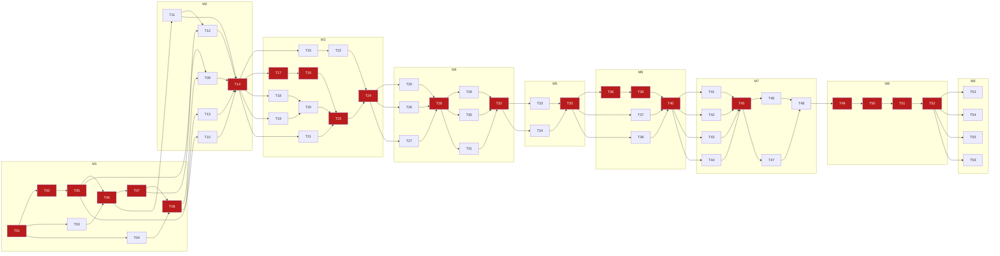

# telegram-tui — implementation plan

> **For agentic workers:** REQUIRED SUB-SKILL: Use superpowers:subagent-driven-development (recommended) or superpowers:executing-plans to implement this plan task-by-task. Tasks use checkbox (`- [ ]`) syntax for tracking.

**Goal:** Build `tgt`, a keyboard-driven terminal Telegram client on TDLib and ratatui, milestone by milestone, with a fleet of subagents working in parallel where file ownership permits.

**Architecture:** The Elm architecture over one mpsc action channel; three crates (`tgt-core` pure domain, `tgt-ui` rendering, `tgt-app` composition root). All types, signatures, and module responsibilities are defined in `docs/architecture.md` — that document is the inter-task contract. The product spec is `docs/superpowers/specs/2026-07-30-telegram-tui-design.md`.

**Tech stack:** Rust 1.97.1 (edition 2024), tdlib-rs 1.4.0 (`download-tdlib`), ratatui 0.30.2 + crossterm 0.29.0, tokio 1.53.1, tracing-batteries @ `f059e936623c2eb0ca67f6ae3301487c9443ffd0`, insta, mise.

## Global constraints

Copied from the spec; every task's requirements implicitly include these.

- `tgt-core` must not depend on `ratatui` or `crossterm`; `tgt-ui` must not depend on `tdlib-rs`. CI-enforced via `scripts/check-crate-boundaries.sh`.
- `App::update(&mut self, Action) -> Vec<Effect>` does no I/O, spawns nothing, reads no clock or RNG. Time arrives as `Action::Tick { now }`.
- One action channel. No `Arc<RwLock<AppState>>`, no locks in the render path.
- Telemetry is allowlist-enforced: `telemetry::emit!` is the only exporter path, gated on `telemetry.public = true`; the CI test of spec §13.8 must pass. Message text, names, usernames, phone numbers, chat titles, file names, and raw Telegram ids must be structurally incapable of reaching the network.
- Telegram entity offsets are UTF-16 code units; conversion happens only in `tgt_ui::render::offsets`.
- Chat order comes from TDLib `order: i64` via `updateChatPosition`. Never computed locally.
- `getChatHistory` may return zero messages while more history exists (`MAX_EMPTY_ATTEMPTS = 3` retries with `only_local = false` before `Exhausted`).
- Nothing writes to stdout/stderr while the TUI is active; the panic hook restores the terminal before printing.
- macOS / Apple Silicon (`aarch64-apple-darwin`) only; no Linux/Windows conditionals, no architecture that forecloses them.
- Local tooling via mise with exact pins; TDLib via the `download-tdlib` cargo feature. No Homebrew, no `curl | bash`, no global installs.
- Dependency versions are pinned exact (`=`) and live only in the Cargo.toml files written by T01.

## Execution rules (read before dispatching any subagent)

1. **File ownership is law.** A task edits only the files under **Owns**. Within any parallel group, ownership sets are disjoint — verified below per group. If a task discovers it needs to edit a file it does not own, it stops and reports; the orchestrator re-sequences.
2. **Cargo.toml files are written once**, by T01, with the full final dependency set from architecture §6. No other task touches any Cargo.toml. This removes the most common merge collision.
3. **`lib.rs`/module trees are written once**, by T01: every source file in architecture §2 is created as a stub (`//! Implemented by T<NN>; see docs/plan.md.`) and every `mod`/`pub mod` declaration already exists. Tasks fill their stubs; nobody edits a `lib.rs` again.
4. **`crates/core/src/app.rs` is a serialization point.** At most one task per parallel group may touch it; that task is marked "(owns app.rs routing)" below.
5. **TDD per task:** write the task's tests first, watch them fail, implement, watch them pass. One commit per task, conventional message (`feat(core): …`, `test(ui): …`).
6. **Definition of done, every task** (in addition to task acceptance):
   ```
   cargo fmt --all -- --check
   cargo clippy --workspace --all-targets -- -D warnings
   cargo test --workspace
   ./scripts/check-crate-boundaries.sh
   ```
   `main` is never left red: a task merges only when all four pass.
7. **Instrumentation is not a retrofit.** From T06 on, any task whose feature appears in `schema::actions` emits the matching `Effect::Telemetry` (e.g. T26 delete → `message.delete`). T52 proves the union stays inside the allowlist.
8. Types and signatures come from `docs/architecture.md`. A task needing a neighbor's type reads it there. Renaming a shared type requires editing architecture.md first — which no parallel task does unilaterally.

## Dependency graph and critical path



**Critical path:** T01 → T02 → T05 → T06 → T07 → T08 → T14 → T17 → T16 → T23 → T24 → T28 → T32 → T35 → T36 → T39 → T40 → T45 → T49 → T50 → T51 → T52 → M9 gate. Everything off this chain is parallel capacity.

**Parallel groups** (all members may run concurrently; ownership verified disjoint):

| Group | Tasks | Serialization note |
|---|---|---|
| A (M1) | T02, T03, T04 | — |
| B (M2) | T09, T10, T11, T13 | — |
| C (M3) | T15, T17, T18, T19, T21 | — |
| D (M3) | T22, T23 | — |
| E (M4) | T25, T26, T27 | T26 also edits `state/conversation.rs` (sole owner in group) |
| F (M4) | T29, T30, T31 | — |
| G (M5) | T33, T34 | T34 owns app.rs routing |
| H (M6) | T36, T37, T38 | T36 owns app.rs routing |
| I (M7) | T41, T42, T43, T44 | none touch app.rs (T45 wires routing) |
| J (M7) | T46, T47 | — |
| K (M9) | T53, T54, T55, T56 | — |

---

## Milestone 1 — Skeleton

Demo at gate: `cargo run -p tgt-app` shows an empty two-pane shell with a hint
bar; `ctrl+c` quits cleanly; a forced panic leaves a usable shell; log file
appears under `~/.local/state/telegram-tui/`; boundaries check passes; TDLib
links and its dylib resolves.

### - [ ] T01 — workspace scaffold

**Goal:** The entire repository skeleton: workspace, toolchain pins, every Cargo.toml with the final dependency set, every source file as a stub with complete module trees, the boundary-check script, CI.
**Owns (create):** `Cargo.toml`, `rust-toolchain.toml`, `.mise.toml`, `.gitignore`, `scripts/check-crate-boundaries.sh`, `.github/workflows/ci.yml`, `crates/{core,ui,app}/Cargo.toml`, every `src/**/*.rs` listed in architecture §2 as a stub, `crates/app/tests/fixtures/.gitkeep`.
**Reads:** `docs/architecture.md` §2, §6, §9.1.
**Depends on:** nothing.
**Interfaces produced:** package names `tgt-core`/`tgt-ui`/`tgt-app`, bin `tgt`; the module tree every later task fills.
**Tests:** none beyond compilation (stubs are empty).
**Acceptance:**
- `cargo build --workspace` succeeds (downloads TDLib via `download-tdlib`).
- `./scripts/check-crate-boundaries.sh` exits 0.
- `mise install && mise exec -- cargo insta --version` succeeds.
- `cargo tree -p tgt-app | grep 'tracing-batteries'` shows rev `f059e936`.
- CI workflow runs the definition-of-done commands on `macos-15`.

### - [ ] T02 — core model types `group A`

**Goal:** All plain data types of the domain: ids, time, key, entity, message, chat — plus `TdError`, which `SendState::Failed` embeds and which depends on nothing else in `td/`.
**Owns:** `crates/core/src/model/{ids,time,key,entity,message,chat}.rs`, `crates/core/src/td/error.rs` (ownership transferred from T05 by the orchestrator: `model/message.rs` cannot compile without `TdError`, and T05 depends on T02 — a cycle otherwise. `TdError::telemetry_kind` returns string literals matching `schema::error_kinds`, no import of T03's module).
**Reads:** architecture §4.1, §4.2, §4.7 (`TdError` only). Must not touch `model/chips.rs` (T26's).
**Depends on:** T01.
**Interfaces produced:** every type in architecture §4.1–§4.2, field-for-field; `TdError` + `telemetry_kind()`.
**Tests (inline):** `chat_order_key_sorts_desc_by_order_then_id` (BTreeSet iteration order matches TDLib expectation, including negative orders and equal orders disambiguated by id); `sender_color_seed_stable`; serde round-trip for `MessageView` and `ChatView` (`serde_json::to_string` → `from_str` → eq); `flood_wait_maps_to_td_flood_wait_kind` (moved from T05 with the file).
**Acceptance:** `cargo test -p tgt-core model::`

### - [ ] T03 — telemetry schema, event, `emit!`, hashing `group A`

**Goal:** The complete allowlist as constants, `TelemetryEvent` with `&'static str` fields, the `emit!` macro setting `telemetry.public = true`, HMAC id hashing.
**Owns:** `crates/core/src/telemetry/{mod,schema,emit,hashing}.rs`.
**Reads:** architecture §4.8; spec §13.2–§13.4.
**Depends on:** T01.
**Interfaces produced:** `schema::ALLOWED_KEYS`, `schema::{keys,actions,error_kinds,buckets}`, `TelemetryEvent` + builders, `emit!`, `hash_id(&[u8;32], i64) -> String`.
**Tests:** `allowlist_snapshot` (insta snapshot of `ALLOWED_KEYS` — an addition is a reviewed diff); `hash_id_is_stable_within_salt_and_differs_across_salts`; `hash_id_is_8_bytes_hex` (16 lowercase hex chars); `width_bucket_boundaries` (79→`<80`, 80→`80-120`, 120→`80-120`, 121→`120-160`, 161→`>160`); `emit_macro_compiles_with_event_builder` (trybuild-free: just invoke it in a test).
**Acceptance:** `cargo test -p tgt-core telemetry::` and `cargo insta test -p tgt-core --check`

### - [ ] T04 — TDLib linking and the macOS rpath mechanism `group A`

**Goal:** `tdlib-rs` links, the dylib resolves at dev runtime, and the packaged-layout rpath is already baked in (architecture §9.2). This is milestone 1's explicit answer to the relocation risk.
**Owns:** `crates/app/build.rs`, `crates/app/tests/tdlib_link.rs`.
**Reads:** architecture §9.2; tdlib-rs 1.4.0 docs/source for the download output path.
**Depends on:** T01.
**Interfaces produced:** a binary whose `LC_RPATH` contains `@executable_path` and `@executable_path/../lib`; `libtdjson.dylib` copied next to dev binaries.
**Tests:** `tdlib_link.rs::tdlib_executes_synchronously` — call a synchronous tdlib-rs function (e.g. set log verbosity / version option) and assert a non-error result, proving link + load.
**Acceptance:**
- `cargo test -p tgt-app --test tdlib_link`
- `otool -l target/debug/deps/tdlib_link-* | grep -A2 LC_RPATH | grep -q '@executable_path'`

### - [ ] T05 — TDLib boundary types and trait

**Goal:** `TdRequest`, `TdResponse`, `TdlibParams`, `TdUpdate`, `AuthPhase`, `ConnectionPhase`, and the `TdRuntime` trait. (`TdError` moved to T02 — see its block.)
**Owns:** `crates/core/src/td/{runtime,request,update}.rs`.
**Reads:** architecture §4.7; T02's model types and `td/error.rs`. Must not touch `td/fake.rs` (T10's) or `td/error.rs` (T02's).
**Depends on:** T02.
**Interfaces produced:** everything in architecture §4.7 except `FakeTd` and `TdError`; `TdRequest::kind() -> &'static str`.
**Tests:** serde round-trip `TdUpdate` and `TdRequest` (fixture format depends on it); `request_kind_names_are_unique` (collect kinds of one value per variant into a set, assert no dupes).
**Acceptance:** `cargo test -p tgt-core td::`

### - [ ] T06 — Action, Effect, App root, focus stack

**Goal:** The `Action`/`TdResult`/`IoResult` enums, `Effect`/`ConfigPatch`/`TelemetryMode`, `Focus`/`ModalKind`/`FocusStack`, and an `App` whose `update()` handles `Tick` (caches `now`), `Resize` (dirty + cache-generation note), `Key(Ctrl('c'))` → `Effect::Quit`, and stores `Boot`. Sub-state structs referenced by `AppState` get their minimal `Default`-able definitions in their own files ONLY if their owning task is later than T06 — write them exactly as architecture §4.6 defines the struct, without handlers.
**Owns:** `crates/core/src/{action,effect,app}.rs`, `crates/core/src/state/{focus,consent,auth,chat_list,conversation,history,composer,palette,search,toasts,media,presence}.rs` (struct definitions and constants only; handler functions come with their owning tasks). `state/selection.rs` stays a stub — `SelectionState` references `Chip`, which T26 creates.
**Reads:** architecture §4.3–§4.6; T03, T05 types.
**Depends on:** T03, T05.
**Interfaces produced:** `App::{new, update, take_dirty, state}`, `Boot`, all sub-state struct definitions.
**Tests:** `esc_pops_exactly_one_level_and_never_the_base`; `ctrl_c_yields_quit_effect`; `tick_updates_now_without_effects`; `update_is_deterministic` (same action sequence twice from `App::new` → equal debug output).
**Acceptance:** `cargo test -p tgt-core app::` and `cargo test -p tgt-core state::focus`

### - [ ] T07 — ui shell: theme, input mapping, root view, hint bar, header

**Goal:** Default theme, mechanical crossterm→`Action` mapping, and a root view that renders the two-pane frame (borders, titles, empty panes) plus hint bar and connection indicator.
**Owns:** `crates/ui/src/lib.rs` view fn body, `crates/ui/src/theme/mod.rs`, `crates/ui/src/input/mod.rs`, `crates/ui/src/view/{root,hint_bar,header}.rs`.
**Reads:** architecture §4.9; `AppState` fields (T06).
**Depends on:** T06.
**Interfaces produced:** `tgt_ui::view(state, theme, f, cache)`, `input::map_event`, `Theme::{default_dark, sender_color, degraded}`.
**Tests:** `map_event_translates_alt_enter_and_ctrl_keys` (crossterm KeyEvent with ALT+Enter → `Key::AltEnter`, CTRL+'p' → `Key::Ctrl('p')`); `sender_color_deterministic`; frame smoke test with `TestBackend::new(120, 40)` asserting the buffer contains `CHATS` and the hint bar text.
**Acceptance:** `cargo test -p tgt-ui`

### - [ ] T08 — app shell: main loop, panic hook, file logging, CLI

**Goal:** A running empty client: terminal setup/teardown, panic hook restoring the terminal before printing, rolling file log (no stdout/stderr while active), the `tokio::select!` loop with 250 ms tick and 16 ms draw gate, dispatcher skeleton executing `Effect::Quit`/`Effect::Telemetry` (others log-and-drop until their tasks land), `--version`.
**Owns:** `crates/app/src/{main,cli,runtime_loop,dispatch,logging,panic}.rs`.
**Reads:** architecture §3, §2.3; T06, T07.
**Depends on:** T04, T07.
**Interfaces produced:** `dispatch::Dispatcher::dispatch(Effect)` (completions → action channel), `panic::install(restore_fn)`, `logging::init() -> WorkerGuard`.
**Tests:** `logging_writes_under_state_dir` (tempdir override via `XDG_STATE_HOME`); `panic_hook_runs_restore_before_default` (install with a flag-setting restore closure, `catch_unwind`, assert flag).
**Acceptance:**
- `cargo test -p tgt-app`
- `cargo run -p tgt-app -- --version` prints version and exits 0.
- **Milestone 1 gate:** definition-of-done commands, plus `otool -l target/debug/tgt | grep -q '@executable_path'`.

---

## Milestone 2 — Auth

Demo at gate: with real credentials, `tgt` walks my.telegram.org wizard → phone
or QR login → 2FA → "logged in" state; the integration test replays the whole
flow against `FakeTd`.

### - [ ] T09 — `TdlibRuntime` `group B`

**Goal:** The real `TdRuntime`: tdlib-rs client, `spawn_blocking` receive loop, request/response mapping with `@extra` correlation, update pre-digestion, error mapping including `FLOOD_WAIT_n`, TDLib logs to file.
**Owns:** `crates/app/src/td_runtime.rs`.
**Reads:** architecture §7, §4.7; tdlib-rs API.
**Depends on:** T04, T05.
**Interfaces produced:** `TdlibRuntime::new(params_source) -> Self` implementing `TdRuntime`.
**Tests:** mapping unit tests that do not hit the network: `flood_wait_message_parses_seconds` ("Too Many Requests: retry after 42" → `TdError::FloodWait{seconds: 42}`); `reply_excerpt_truncated_to_one_line`.
**Acceptance:** `cargo test -p tgt-app td_runtime`

### - [ ] T10 — `FakeTd` and the fixture format `group B`

**Goal:** JSONL fixture replay implementing `TdRuntime`: `Emit` pushes updates, `Await` blocks for a matching request and answers it, unmatched requests get `Ok` and are recorded.
**Owns:** `crates/core/src/td/fake.rs`.
**Reads:** architecture §4.7 (`ScriptStep`, `RequestMatcher`, `RespondWith`).
**Depends on:** T05.
**Interfaces produced:** `FakeTd::{from_jsonl, received}` + `TdRuntime` impl.
**Tests:** `emit_steps_arrive_in_order`; `await_matches_kind_and_responds`; `await_exact_mismatch_gets_default_ok_and_is_recorded`; `malformed_jsonl_line_reports_line_number`.
**Acceptance:** `cargo test -p tgt-core td::fake`

### - [ ] T11 — auth state projection `group B`

**Goal:** `state/auth.rs` handlers: project `AuthPhase` updates into wizard state, route field input, submit on Enter (→ `Effect::Td(...)`), inline `FieldError`s, flood-wait countdown vs `AppState.now`, credentials wizard writing `ConfigPatch::Credentials`.
**Owns:** `crates/core/src/state/auth.rs` (handlers; struct exists from T06).
**Reads:** architecture §4.6; spec §9.
**Depends on:** T06.
**Interfaces produced:** `auth::{handle_key, handle_td, handle_tick}` per the canonical handler shapes.
**Tests:** `wait_code_renders_delivery_and_submits_check_code`; `wrong_code_error_lands_on_code_field_and_preserves_phase`; `flood_wait_disables_submit_until_deadline` (advance via `Tick`); `qr_link_refresh_replaces_link`; `ready_switches_screen_to_main_and_loads_chats` (effects contain `LoadChats`); `no_credentials_shows_wizard_and_saves_config_patch`.
**Acceptance:** `cargo test -p tgt-core state::auth`

### - [ ] T13 — config and Keychain `group B`

**Goal:** TOML config load/generate with comments, unknown-key warning (local log only), env overrides (`TELEGRAM_API_ID/HASH`, `TELEGRAM_TUI_TELEMETRY`, `DO_NOT_TRACK`), `ConfigPatch` application + atomic save; 32-byte DB key get-or-create in the macOS Keychain; td database dir at mode `0700`.
**Owns:** `crates/app/src/{config,keychain}.rs`.
**Reads:** spec §12, §9.3; architecture §4.4 (`ConfigPatch`).
**Depends on:** T06, T08.
**Interfaces produced:** `config::{load, apply_patch, Config}` (Config carries everything `Boot` needs), `keychain::db_key() -> eyre::Result<[u8; 32]>`.
**Tests:** `generates_commented_default_on_first_run` (tempdir + `XDG_CONFIG_HOME`); `unknown_keys_warn_but_load`; `env_overrides_beat_file`; `do_not_track_forces_mode_off`; `apply_patch_roundtrips`. Keychain: `db_key_is_stable_across_calls` marked `#[ignore]` (touches the real Keychain; run manually).
**Acceptance:** `cargo test -p tgt-app config` and `cargo test -p tgt-app keychain -- --ignored` (manual, documented in the task)

### - [ ] T12 — auth wizard views

**Goal:** All auth screens: credentials wizard (my.telegram.org explainer), method choice, phone/code/password fields with inline errors and flood countdown, QR via `qrcode` Unicode half-blocks sized to viewport with raw-link fallback.
**Owns:** `crates/ui/src/view/auth.rs`.
**Reads:** `AuthState` (T11), `Theme`.
**Depends on:** T07, T11.
**Interfaces produced:** `view::auth::draw(state: &AppState, theme: &Theme, f: &mut Frame)`.
**Tests:** `TestBackend` snapshots (insta) at 120×40 and 70×20 for: method choice, code entry with error, QR screen (fixed link → deterministic QR), too-small-for-QR fallback.
**Acceptance:** `cargo test -p tgt-ui view::auth`

### - [ ] T14 — auth wiring and integration test

**Goal:** Wire it together: `main.rs` builds `Boot` from config/Keychain, chooses `TdlibRuntime`, routes auth actions in `app.rs`; dispatcher executes `Effect::Td` auth requests and `Effect::SaveConfig`. Integration test boots the full app against `FakeTd`.
**Owns:** `crates/core/src/app.rs` (routing arms), `crates/app/src/{main,runtime_loop,dispatch}.rs` (edits), `crates/app/tests/auth_flow.rs`, `crates/app/tests/fixtures/auth_phone.jsonl`, `crates/app/tests/fixtures/auth_qr.jsonl`.
**Reads:** all of M2.
**Depends on:** T09, T10, T11, T12, T13.
**Tests:** `auth_flow.rs::phone_login_reaches_ready` (fixture: WaitTdlibParameters → … → Ready; assert `Screen::Main` and a `LoadChats` request in `FakeTd::received()`); `qr_login_reaches_ready`; `flood_wait_surfaces_countdown_not_generic_error`.
**Acceptance:**
- `cargo test -p tgt-app --test auth_flow`
- **Milestone 2 gate:** definition-of-done commands all green.

---

## Milestone 3 — Read-only client

Demo at gate: logged in, the chat list shows real chats in TDLib order; opening
one renders grouped accent-rail history; scrolling up pages further back,
surviving the empty-response trap.

### - [ ] T15 — chat list state `group C`

**Goal:** Mirror TDLib ordering: react to `NewChat`, `ChatPosition` (order 0 removes), `ChatLastMessage`, `ChatReadInbox/Outbox`, `ChatTitle`, `ChatNotificationSettings`; selection movement, open on Enter (→ `OpenChat`, `ViewMessages` effects), `/` filter.
**Owns:** `crates/core/src/state/chat_list.rs` (handlers).
**Reads:** architecture §4.6; spec §5.1.
**Depends on:** T14.
**Interfaces produced:** `chat_list::{handle_key, handle_td}`; `chat_list::visible_rows(&ChatListState) -> Vec<ChatId>` (order-set walk, filter applied).
**Tests:** `position_update_reorders_without_local_computation` (permute orders, assert exact TDLib order incl. tie on order → id DESC); `order_zero_removes_from_list`; `enter_opens_selected_chat_and_emits_open_chat`; `filter_narrows_without_reordering`; `read_inbox_clears_badge`.
**Acceptance:** `cargo test -p tgt-core state::chat_list`

### - [ ] T17 — history paging machine `group C`

**Goal:** The freestanding `PagingState` machine of architecture §4.6 — the spec's empty-response trap encoded as tests.
**Owns:** `crates/core/src/state/history.rs`.
**Reads:** spec §5.2.
**Depends on:** T14.
**Interfaces produced:** `PagingState`, `PagingDirective`, `on_scroll_near_top`, `on_history_loaded`, `on_history_error`, constants `PAGE_SIZE`/`PAGE_TRIGGER_MESSAGES`/`MAX_EMPTY_ATTEMPTS`.
**Tests (exhaustive, table-driven):**
  - `idle_scroll_near_top_requests_page` (directive carries `from_message_id = oldest`, `only_local = false`).
  - `loading_ignores_further_scroll` (no duplicate requests).
  - `empty_response_retries_up_to_max` (attempts 1→2→3 re-request; 3rd empty non-local → `Exhausted`).
  - `empty_local_response_never_exhausts` (was_only_local = true → always re-request remote).
  - `nonempty_response_resets_to_idle_and_prepends`.
  - `short_but_nonempty_response_is_not_exhausted` (1 message received → `Idle`).
  - `flood_wait_enters_cooldown_until_deadline` and `cooldown_expires_back_to_idle_on_next_scroll`.
  - `exhausted_never_requests_again`.
**Acceptance:** `cargo test -p tgt-core state::history`

### - [ ] T16 — conversation state

**Goal:** Per-chat window: prepend pages / append news, `Scroll::At` anchor stability across prepends, `WINDOW_MAX_MESSAGES` eviction (evict the end far from the anchor), read markers, `NewMessage`/`MessagesDeleted`/`MessageContentChanged` handling, spoiler reveal set.
**Owns:** `crates/core/src/state/conversation.rs` (handlers).
**Reads:** architecture §4.6; T17's directives.
**Depends on:** T17.
**Interfaces produced:** `conversation::{handle_key, handle_td, apply_history_page}`; `conversation::open(app, chat_id)`.
**Tests:** `prepend_preserves_scroll_anchor`; `eviction_keeps_anchor_side`; `new_message_at_bottom_stays_pinned_to_bottom`; `new_message_while_scrolled_up_does_not_jump`; `deleted_messages_removed_from_window`; `history_loaded_routes_through_paging_machine` (empty page triggers re-request effect).
**Acceptance:** `cargo test -p tgt-core state::conversation`

### - [ ] T18 — UTF-16 offset conversion `group C`

**Goal:** Constraint 5's isolated pure function: `utf16_span_to_byte_range`, exactly as specified in architecture §4.9. Highest-probability correctness bug in the project; the test table below is the deliverable as much as the function.
**Owns:** `crates/ui/src/render/offsets.rs`.
**Reads:** architecture §4.9.
**Depends on:** T14 (nominal; no code dependency — may start any time after T01).
**Tests — this exact table, each row one assertion:**

| # | text | (offset, len) UTF-16 | expected byte range |
|---|---|---|---|
| 1 | `"hello world"` | (0, 5) | `Some(0..5)` |
| 2 | `"müller"` | (1, 1) | `Some(1..3)` |
| 3 | `"🙂 ok"` | (3, 2) | `Some(5..7)` |
| 4 | `"你好 hi"` | (3, 2) | `Some(7..9)` |
| 5 | `"e\u{0301}x"` (e + combining acute) | (0, 2) | `Some(0..3)` |
| 6 | `"👨\u{200D}👩\u{200D}👧"` (ZWJ family) | (0, 8) | `Some(0..18)` |
| 7 | `"🇩🇪!"` | (4, 1) | `Some(8..9)` |
| 8 | `"🙂"` | (1, 1) — starts mid-surrogate | `None` |
| 9 | `"a🙂b"` | (0, 2) — ends mid-surrogate | `None` |
| 10 | `"hi"` | (5, 1) — offset past end | `None` |
| 11 | `"hi"` | (0, 5) — length past end | `None` |
| 12 | `"hi"` | (0, 0) | `Some(0..0)` |
| 13 | `"🙂"` | (0, 2) | `Some(0..4)` |
| 14 | `"a𝕏b"` | (0, 4) | `Some(0..6)` |

Plus a property test (plain loop, no proptest dep): for every prefix length of a corpus string mixing ASCII/CJK/emoji, converting `(0, prefix_utf16_len)` yields a range ending on a char boundary.
**Acceptance:** `cargo test -p tgt-ui render::offsets`

### - [ ] T19 — grapheme/width-aware wrapping `group C`

**Goal:** `wrap_spans`: grapheme clusters never split, display width (not char count) drives breaks, width-1 pathological case, over-wide grapheme gets its own line, style survives wrapping.
**Owns:** `crates/ui/src/render/wrap.rs`.
**Reads:** architecture §4.9.
**Depends on:** T14 (nominal).
**Tests:** `cjk_wraps_at_display_width` (width 10, "你好你好你好" → 5 chars/row? no: width 10 fits 5 double-width chars → rows of 5); `emoji_grapheme_not_split`; `combining_mark_stays_with_base`; `width_one_column_yields_one_grapheme_per_line`; `zero_width_joiner_family_single_cluster`; `style_preserved_across_break`; `spaces_break_preferred_over_mid_word` (soft wrap at spaces when possible).
**Acceptance:** `cargo test -p tgt-ui render::wrap`

### - [ ] T21 — layout cache `group C`

**Goal:** `LayoutCache` per architecture §4.9: LRU bounded by total line count (`MAX_CACHED_LINES = 50_000`), pop-until-under-bound on insert, wholesale `clear()`.
**Owns:** `crates/ui/src/render/cache.rs`.
**Reads:** architecture §4.9.
**Depends on:** T14 (nominal).
**Tests:** `hit_returns_without_calling_closure`; `total_lines_tracks_inserts_and_evictions`; `eviction_pops_lru_until_under_bound` (insert entries of known line counts, exceed bound, assert oldest-used gone and sum ≤ bound); `clear_resets_everything`; `distinct_key_components_miss` (width/theme_generation/spoilers each change → miss).
**Acceptance:** `cargo test -p tgt-ui render::cache`

### - [ ] T20 — message layout engine

**Goal:** `layout_message`: entities → byte ranges (via T18) → styled spans → wrapped lines (via T19); accent rail `▏`, grouped headers (caller decides via `GROUP_WINDOW_SECS`), own-message right alignment, dim rail for own, timestamps via jiff. Basic entity set this milestone: bold, italic, code, url; the rest in T33.
**Owns:** `crates/ui/src/render/message_layout.rs`.
**Reads:** T18, T19 signatures; spec §7.1, §8.1.
**Depends on:** T18, T19.
**Interfaces produced:** `layout_message(msg, width, theme) -> Vec<Line<'static>>`, `GROUP_WINDOW_SECS`.
**Tests:** `plain_text_wraps_with_rail_prefix`; `bold_entity_after_emoji_styles_correct_slice` (the classic mis-slice regression); `own_message_right_aligned`; `invalid_entity_renders_unstyled_not_panic`; `one_column_width_does_not_panic`; `message_of_single_emoji_lays_out`.
**Acceptance:** `cargo test -p tgt-ui render::message_layout`

### - [ ] T22 — chat list view `group D`

**Goal:** Sidebar rendering: rows from `chat_list::visible_rows`, selection highlight, unread/mention badges, muted styling, `CHATS` header.
**Owns:** `crates/ui/src/view/chat_list.rs`.
**Reads:** `ChatListState` (T15), `Theme`.
**Depends on:** T15.
**Tests:** insta `TestBackend` snapshots: populated list with badges at 120×40; filtered list; empty state.
**Acceptance:** `cargo test -p tgt-ui view::chat_list`

### - [ ] T23 — conversation view `group D`

**Goal:** Message viewport: walk the window bottom-up from the scroll anchor, pull lines from `LayoutCache` (`get_or_insert_with` → `layout_message`), sender grouping, day change awareness deferred (v1 renders plain), viewport-driven visible-range for later media priority.
**Owns:** `crates/ui/src/view/conversation.rs`.
**Reads:** T16, T20, T21.
**Depends on:** T16, T20, T21.
**Interfaces produced:** `view::conversation::draw(...)` plus `visible_range(state, height, cache) -> (MessageId, MessageId)` for T38's inline-image placement (stays inside `tgt-ui`; core derives download priority from anchor distance instead).
**Tests:** insta snapshots at 120×40 and 80×24: mixed incoming/outgoing grouped history; scrolled-to-middle anchor; empty conversation.
**Acceptance:** `cargo test -p tgt-ui view::conversation`

### - [ ] T24 — read-only integration

**Goal:** Full-app test: auth → chat list populates in TDLib order → open chat → history pages (including one empty-then-retry round) — all against `FakeTd`.
**Owns:** `crates/app/tests/read_only.rs`, `crates/app/tests/fixtures/read_only.jsonl`, `crates/core/src/app.rs` (routing arms for M3), `crates/app/src/dispatch.rs` (Td request execution paths for M3).
**Depends on:** T22, T23.
**Tests:** `chat_list_matches_tdlib_order_after_position_storm`; `open_chat_loads_history_and_renders`; `empty_history_response_retries_then_succeeds` (fixture: Await GetChatHistory → respond `Messages{[]}` → Await again → respond 50 messages; assert both requests in `received()` and window length 50).
**Acceptance:**
- `cargo test -p tgt-app --test read_only`
- **Milestone 3 gate:** definition-of-done green; manual demo with a real account works.

---

## Milestone 4 — Interaction

Demo at gate: full keyboard driving — panes, selection mode with live chips,
reply/edit/delete/forward/copy, composer send with optimistic echo, responsive
below 100 columns.

### - [ ] T25 — composer state `group E`

**Goal:** Composer handlers: typing/cursor/backspace, `alt+enter` newline, Enter → `pending_send` + `Effect::Td(SendMessageText)`, `↑` on empty input enters selection mode (pushes `Focus::Selection`), edit submission, `MessageSent`/`MessageSendFailed` reconciliation (restore text on failure — never discard).
**Owns:** `crates/core/src/state/composer.rs` (handlers).
**Depends on:** T24.
**Interfaces produced:** `composer::{handle_key, handle_td_result, handle_td}`.
**Tests:** `enter_sends_and_holds_pending`; `send_failure_restores_text_to_input`; `send_success_drops_pending`; `alt_enter_inserts_newline`; `up_on_empty_enters_selection`; `up_on_nonempty_moves_cursor`; `edit_mode_submits_edit_message_text`.
**Acceptance:** `cargo test -p tgt-core state::composer`

### - [ ] T26 — selection mode and chips `group E`

**Goal:** `chips_for` derivation (architecture §4.2) and selection handlers: enter/leave selection, `↑`/`↓` message movement, `←`/`→` chip cursor with scroll, `⏎` invoke, letter shortcuts, chip actions emitting effects (Reply → composer context, Copy → `Effect::CopyToClipboard`, Delete → push `Modal(ConfirmDelete)`, Forward → chat picker via palette deferred to T41 — v1 forwards to the currently filtered chat list selection, Edit → composer edit mode, React → `ToggleReaction` with default emoji set). Adds `selection: Option<SelectionState>` field to `ConversationState`.
**Owns:** `crates/core/src/state/selection.rs`, `crates/core/src/model/chips.rs`, `crates/core/src/state/conversation.rs` (field + selection plumbing only).
**Depends on:** T24.
**Interfaces produced:** `chips_for(...)`, `selection::{handle_key}` per architecture.
**Tests:** `chips_derive_from_caps_never_hardcoded` (table over caps combinations incl. failed-send → Resend/Delete only); `chip_shortcut_letters_unique_per_row`; `delete_requires_modal_confirmation`; `esc_returns_to_composer`; `selection_starts_at_newest`.
**Acceptance:** `cargo test -p tgt-core state::selection model::chips`

### - [ ] T27 — modals and destructive ops `group E`

**Goal:** Modal handlers: `ConfirmDelete` (Delete-for-me vs Delete-for-everyone from `can_be_deleted_for_all_users`), Enter confirm → `DeleteMessages{revoke}`, Esc dismiss; `ConfirmSendFile` scaffold for M6.
**Owns:** `crates/core/src/state/modal.rs`.
**Depends on:** T24.
**Interfaces produced:** `modal::{handle_key}`.
**Tests:** `revoke_option_present_only_when_capable`; `confirm_emits_delete_with_revoke_flag`; `esc_dismisses_without_effect`.
**Acceptance:** `cargo test -p tgt-core state::modal`

### - [ ] T28 — key routing integration (owns app.rs routing)

**Goal:** The full §6.2 routing table in `App::update`: modal → focused pane → global; pane movement `←`/`→`/`tab`; focus-stack invariants; wire M4 handlers.
**Owns:** `crates/core/src/app.rs`, `crates/core/src/state/focus.rs` (edits).
**Depends on:** T25, T26, T27.
**Tests:** `modal_swallows_keys_from_panes`; `first_claimant_stops_propagation`; `tab_cycles_focus_shift_tab_reverses`; `global_palette_key_reaches_through_panes_but_not_modals`; scripted end-to-end `update()` sequence: open chat → select → reply → send (assert exact effect list).
**Acceptance:** `cargo test -p tgt-core app::routing`

### - [ ] T29 — chips, hint bar, modal views `group F`

**Goal:** Chip row with focused-chip highlight, leading-letter accent, `‹ ›` scroll affordances; context-dependent hint bar; centered modal.
**Owns:** `crates/ui/src/view/{chips,modal}.rs`, `crates/ui/src/view/hint_bar.rs` (edit).
**Depends on:** T28.
**Tests:** insta snapshots: chip row fitting; chip row overflowing with `‹ ›`; delete modal both variants; hint bar per focus context.
**Acceptance:** `cargo test -p tgt-ui view::chips view::modal`

### - [ ] T30 — composer view `group F`

**Goal:** Rounded input box per spec mock, reply/edit banner above, multi-line growth, cursor rendering.
**Owns:** `crates/ui/src/view/composer.rs`.
**Depends on:** T28.
**Tests:** insta snapshots: empty placeholder; multi-line content; reply banner; edit banner.
**Acceptance:** `cargo test -p tgt-ui view::composer`

### - [ ] T31 — responsive layout `group F`

**Goal:** Single-pane stack below `layout_breakpoint_cols` (default 100): full-width list → conversation with breadcrumb `telegram ▸ <chat>`, Esc back; same components, different arrangement.
**Owns:** `crates/ui/src/view/root.rs` (edit).
**Depends on:** T28.
**Tests:** insta snapshots at 99×30 (stack, list), 99×30 with open chat (stack, conversation + breadcrumb), 100×30 (two-pane) — both sides of the breakpoint.
**Acceptance:** `cargo test -p tgt-ui view::root`

### - [ ] T32 — interaction integration

**Goal:** Full-app send flow against `FakeTd`: optimistic append with temp id → `MessageSendSucceeded` swaps to final id → read receipt; failure path restores composer text.
**Owns:** `crates/app/tests/send_flow.rs`, `crates/app/tests/fixtures/send_flow.jsonl`, `crates/app/src/dispatch.rs` (edit: clipboard via arboard, remaining Td paths).
**Depends on:** T29, T30, T31.
**Tests:** `optimistic_message_confirmed_with_final_id`; `failed_send_restores_composer_and_marks_failed`; `delete_for_everyone_round_trip`.
**Acceptance:**
- `cargo test -p tgt-app --test send_flow`
- **Milestone 4 gate:** definition-of-done green.

---

## Milestone 5 — Rich content

### - [ ] T33 — full entity styling, spoilers, reply quotes `group G`

**Goal:** Complete the entity set (underline, strikethrough, spoiler blocks revealed via `⏎`, `pre` with language label, blockquote, text_url, mention, hashtag); reply quote as one dimmed `↳` line, selectable jump target.
**Owns:** `crates/ui/src/render/message_layout.rs` (edit).
**Depends on:** T32.
**Tests:** `spoiler_hidden_until_revealed_key_changes` (cache key differs); `pre_block_shows_language_label`; `nested_bold_italic_compose`; `reply_quote_single_dimmed_line`; insta snapshot of a message using every entity kind at width 60.
**Acceptance:** `cargo test -p tgt-ui render::message_layout`

### - [ ] T34 — reactions, receipts, typing, presence state (owns app.rs routing) `group G`

**Goal:** Handle `MessageInteractionInfo`, `ChatReadOutbox` (receipts), `UserStatus`, `ChatAction` with `TYPING_TTL_MS` expiry on Tick; wire routing arms.
**Owns:** `crates/core/src/state/presence.rs` (handlers), `crates/core/src/app.rs` (edit: M5 routing).
**Depends on:** T32.
**Tests:** `typing_expires_after_ttl`; `reaction_update_replaces_message_reactions`; `read_outbox_advances_marker_only` (no per-message mutation).
**Acceptance:** `cargo test -p tgt-core state::presence`

### - [ ] T35 — rich rendering

**Goal:** Reactions row under messages, ✓/✓✓ from `last_read_outbox`, typing indicator and presence in header.
**Owns:** `crates/ui/src/view/conversation.rs` (edit), `crates/ui/src/view/header.rs` (edit).
**Depends on:** T33, T34.
**Tests:** insta snapshots: message with reactions incl. own-reaction highlight; sent vs read checkmarks; header with "typing…" and "online".
**Acceptance:** `cargo test -p tgt-ui view::conversation view::header`
- **Milestone 5 gate:** definition-of-done green.

---

## Milestone 6 — Media

### - [ ] T36 — media state and download priority (owns app.rs routing) `group H`

**Goal:** `updateFile` → `FileSnapshot` table; `DownloadFile` priority from message distance to the scroll anchor — the same proximity proxy the paging trigger uses, because core cannot know laid-out rows (≤ 5 messages from anchor → 32, ≤ 20 → 16, else 4); completion flips message affordance Download→Open; upload progress tracking; M6 routing arms.
**Owns:** `crates/core/src/state/media.rs` (handlers), `crates/core/src/app.rs` (edit).
**Depends on:** T35.
**Interfaces produced:** `media::{handle_td, priority_for(anchor_distance: usize) -> i8}`.
**Tests:** `progress_updates_downloaded_size`; `completion_sets_local_path_and_completed`; `priority_tiers_by_viewport_proximity`; `cancel_emits_cancel_download`.
**Acceptance:** `cargo test -p tgt-core state::media`

### - [ ] T37 — file cards and progress rendering `group H`

**Goal:** Placeholder card (`📎 name · size · ⏎ download`), progress bar while downloading, Open affordance when complete; upload progress on pending messages.
**Owns:** `crates/ui/src/render/message_layout.rs` (edit).
**Depends on:** T35.
**Tests:** insta snapshots: undownloaded document card; 40% download progress; completed; upload pending.
**Acceptance:** `cargo test -p tgt-ui render::message_layout`

### - [ ] T38 — inline images `group H`

**Goal:** Startup graphics-protocol probe (kitty/iterm2/sixel/none); inline photos at bounded height for downloaded files via `ratatui-image`; explicit cell invalidation on scroll (no ghosting); placeholder fallback always available.
**Owns:** `crates/ui/src/render/image.rs`, `crates/app/src/graphics.rs`.
**Depends on:** T35.
**Tests:** `no_protocol_falls_back_to_placeholder`; `image_height_bounded`; probe unit test with faked env (`TERM_PROGRAM=iTerm.app` → iterm2). Ghosting is verified manually at the gate (documented check).
**Acceptance:** `cargo test -p tgt-ui render::image` and `cargo test -p tgt-app graphics`

### - [ ] T39 — sending files

**Goal:** `/send <path>` composer command; pasted bare existing path → offer modal; `ConfirmSendFile` → `SendMessageFile` with MIME-derived kind; cancellable upload.
**Owns:** `crates/core/src/state/composer.rs` (edit), `crates/core/src/state/modal.rs` (edit), `crates/app/src/media_kind.rs`.
**Depends on:** T36.
**Tests:** `send_command_parses_path_and_validates_existence` (tempfile); `pasted_bare_path_offers_send`; `media_kind_from_extension` (jpg→Photo, mp4→Video, mp3→Audio, pdf→Document, unknown→Document); `upload_cancellable_before_completion`.
**Acceptance:** `cargo test -p tgt-core state::composer state::modal` and `cargo test -p tgt-app media_kind`

### - [ ] T40 — media integration

**Goal:** Full-app: download with progress actions → completion → open handoff (`open` invocation mocked via env-overridable command); send file flow.
**Owns:** `crates/app/tests/media_flow.rs`, `crates/app/tests/fixtures/media_flow.jsonl`, `crates/app/src/dispatch.rs` (edit: DownloadFile/OpenExternal paths).
**Depends on:** T37, T38, T39.
**Tests:** `download_progress_drives_snapshot_sequence`; `completed_download_enables_open`; `send_file_emits_upload_and_optimistic_message`.
**Acceptance:**
- `cargo test -p tgt-app --test media_flow`
- **Milestone 6 gate:** definition-of-done green.

---

## Milestone 7 — Search, palette, sidebar organization, notifications

### - [ ] T41 — palette state `group I`

**Goal:** nucleo fuzzy match over chats (score, then TDLib recency) + commands; selection movement; invoke → open chat / run command.
**Owns:** `crates/core/src/state/palette.rs` (handlers).
**Depends on:** T40.
**Tests:** `fuzzy_ranks_score_then_recency` (two chats matching equally → more recent first); `commands_and_chats_interleave_by_score`; `enter_on_chat_opens_it`; `enter_on_quit_emits_quit`.
**Acceptance:** `cargo test -p tgt-core state::palette`

### - [ ] T42 — in-chat search state `group I`

**Goal:** `/` in message list → query input → `SearchChatMessages` → hits into `ConversationState.search_hits`; `n`/`N` stepping moves scroll anchor to hit.
**Owns:** `crates/core/src/state/search.rs` (handlers).
**Depends on:** T40.
**Tests:** `search_submits_request_and_stores_hits`; `n_steps_forward_wraps`; `shift_n_steps_back`; `esc_clears_search_state`.
**Acceptance:** `cargo test -p tgt-core state::search`

### - [ ] T43 — sidebar organization `group I`

**Goal:** Pinned chats above the list (from `is_pinned` in positions), archive pseudo-row entering `ChatListId::Archive`, Telegram folders as switchable lists, mention badges.
**Owns:** `crates/core/src/state/chat_list.rs` (edit), `crates/ui/src/view/chat_list.rs` (edit).
**Depends on:** T40.
**Tests:** `pinned_section_precedes_unpinned_preserving_tdlib_order_within`; `archive_row_switches_active_list`; `folder_switch_swaps_order_set`; insta snapshot with pinned + archive + folder tabs.
**Acceptance:** `cargo test -p tgt-core state::chat_list` and `cargo test -p tgt-ui view::chat_list`

### - [ ] T44 — toasts and terminal alerts `group I`

**Goal:** Toast queue per spec §6.4 (stack ≤ 3, 4 s TTL, esc dismiss, suppressed for focused chat and muted chats); `Effect::Alert` → OSC 777 with generic body (`New message`) or BEL fallback; toast view.
**Owns:** `crates/core/src/state/toasts.rs` (handlers), `crates/app/src/notify.rs`, `crates/ui/src/view/toast.rs`.
**Depends on:** T40.
**Tests:** `toast_only_for_unfocused_unmuted_chats`; `stack_caps_at_three_dropping_oldest`; `expires_on_tick`; `muted_chat_updates_badge_but_no_toast_no_alert`; `notify_osc_body_is_generic_constant` (assert the emitted byte sequence contains no interpolation site — the function takes zero content parameters).
**Acceptance:** `cargo test -p tgt-core state::toasts` and `cargo test -p tgt-app notify`

### - [ ] T45 — M7 routing (owns app.rs routing)

**Goal:** Wire `ctrl+p`, `/`, toast lifecycle on `NewMessage`, alert suppression rules into `App::update`.
**Owns:** `crates/core/src/app.rs` (edit).
**Depends on:** T41, T42, T43, T44.
**Tests:** `ctrl_p_opens_palette_from_any_pane`; `slash_in_message_list_opens_search_but_in_chat_list_opens_filter`; `new_message_in_unfocused_chat_emits_alert_and_toast`.
**Acceptance:** `cargo test -p tgt-core app::routing`

### - [ ] T46 — palette view `group J`

**Goal:** Centered palette with match highlighting and selection.
**Owns:** `crates/ui/src/view/palette.rs`.
**Depends on:** T45.
**Tests:** insta snapshots: results list with highlighted match spans; empty query; no-results state.
**Acceptance:** `cargo test -p tgt-ui view::palette`

### - [ ] T47 — search highlighting view `group J`

**Goal:** Matched-range highlight in the conversation view for the current hit; hit-count indicator in header.
**Owns:** `crates/ui/src/view/conversation.rs` (edit), `crates/ui/src/view/header.rs` (edit).
**Depends on:** T45.
**Tests:** insta snapshot: conversation with active search and highlighted hit; header shows `3/7`.
**Acceptance:** `cargo test -p tgt-ui view::conversation`

### - [ ] T48 — search/palette integration

**Goal:** Full-app: palette open → fuzzy → open chat; in-chat search → step hits (anchor moves, may trigger paging).
**Owns:** `crates/app/tests/search_flow.rs`, `crates/app/tests/fixtures/search_flow.jsonl`.
**Depends on:** T46, T47.
**Tests:** `palette_opens_chat_by_fuzzy_match`; `search_step_to_offscreen_hit_pages_history`.
**Acceptance:**
- `cargo test -p tgt-app --test search_flow`
- **Milestone 7 gate:** definition-of-done green.

---

## Milestone 8 — Observability

The `emit!` macro has existed since T03 and features have emitted
`Effect::Telemetry` all along; this milestone adds the exporter, consent, the
controls, and the proof.

### - [ ] T49 — exporter wiring

**Goal:** `tracing-batteries` session (OpenTelemetry battery, HttpProtobuf, `x-tgt-client` header); OTLP layer filtered to `target == "tgt_telemetry" && telemetry.public` present; bounded queue drop-on-full; 2 s shutdown timeout; vendor endpoint from build-time `TGT_INGEST_ENDPOINT` (absent → vendor mode inert); `OTEL_EXPORTER_OTLP_*` honored; export failures logged at debug, never surfaced.
**Owns:** `crates/app/src/otel.rs`, `crates/app/src/logging.rs` (edit), `crates/app/src/main.rs` (edit).
**Depends on:** T48.
**Interfaces produced:** `otel::init(mode, install_id, session_id) -> OtelGuard` (guard's Drop runs the timed shutdown).
**Tests:** `raw_tracing_event_does_not_reach_export_layer` (spec §13.8 unit test: capture layer in place of exporter; `tracing::info!("chat {}", "TITLE")` absent, `emit!` event present); `shutdown_completes_within_two_seconds_against_black_hole_endpoint`.
**Acceptance:** `cargo test -p tgt-app otel`

### - [ ] T50 — consent screen

**Goal:** First-run screen before login and before any export: plain-language disclosure, Enable preselected, Disable available, acknowledgement required; writes `ConfigPatch::ConsentAcknowledged`; `Screen::Consent` gating in main/app.
**Owns:** `crates/core/src/state/consent.rs` (handlers), `crates/core/src/app.rs` (edit: consent routing), `crates/ui/src/view/consent.rs`, `crates/app/src/main.rs` (edit: no exporter construction before acknowledgement).
**Depends on:** T49.
**Tests:** `consent_blocks_all_other_screens_until_acknowledged`; `disable_sets_mode_off`; insta snapshot of the consent screen at 100×30; integration assertion in T52's test that no export occurs pre-acknowledgement.
**Acceptance:** `cargo test -p tgt-core state::consent` and `cargo test -p tgt-ui view::consent`

### - [ ] T51 — telemetry CLI and config modes

**Goal:** `tgt telemetry show` (prints exactly what a session would send, from schema constants + live values), `tgt telemetry reset-id` (regenerates `install.id` and HMAC salt), `--no-telemetry`, `TELEGRAM_TUI_TELEMETRY=off`, `DO_NOT_TRACK=1`, `mode = "custom"` fully replacing the vendor destination (never dual-shipped).
**Owns:** `crates/app/src/telemetry_cli.rs`, `crates/app/src/cli.rs` (edit), `crates/app/src/config.rs` (edit: custom endpoint/protocol/headers).
**Depends on:** T50.
**Tests:** `show_lists_only_allowlisted_keys` (parse output, subset of `ALLOWED_KEYS`); `reset_id_changes_install_id_and_salt`; `custom_mode_endpoint_replaces_vendor` (config precedence unit test); `no_telemetry_flag_beats_config`.
**Acceptance:** `cargo test -p tgt-app telemetry_cli` and `cargo run -p tgt-app -- telemetry show` exits 0 printing key names only.

### - [ ] T52 — the allowlist proof (CI)

**Goal:** Spec §13.8 end-to-end: boot the app against `FakeTd` with a scripted session touching every action (send, reply, delete, page, search, download, theme change); export to an in-process axum OTLP collector stub; decode with `opentelemetry-proto`; drain every attribute key; assert **subset of `ALLOWED_KEYS`**, fail on any unknown key. Also assert no export happened before consent acknowledgement in the script.
**Owns:** `crates/app/tests/telemetry_allowlist.rs`, `crates/app/tests/support/otlp_stub.rs`, `crates/app/tests/fixtures/telemetry_session.jsonl`.
**Depends on:** T51.
**Tests:** `exported_attribute_keys_are_subset_of_allowlist`; `no_export_before_consent`; `install_id_present_chat_ids_absent` (assert no attribute value matches any raw chat id used in the fixture).
**Acceptance:**
- `cargo test -p tgt-app --test telemetry_allowlist`
- CI job runs this test on every push.
- **Milestone 8 gate:** definition-of-done green.

---

## Milestone 9 — Polish and distribution

### - [ ] T53 — theme file loading `group K`

**Goal:** User theme TOML at config dir, builtin themes, `#rrggbb` + named ANSI parsing, truecolor→256 degradation path selected by terminal capability, `theme_generation` bump on change (cache invalidation).
**Owns:** `crates/ui/src/theme/loader.rs`.
**Depends on:** T52.
**Tests:** `parses_all_twelve_tokens_plus_palette`; `unknown_key_warns_not_fails`; `bad_color_reports_key_and_value`; `degraded_maps_rgb_to_nearest_256`; `theme_change_bumps_generation_and_clears_cache` (core+ui assertion).
**Acceptance:** `cargo test -p tgt-ui theme::loader`

### - [ ] T54 — help overlay `group K`

**Goal:** `?` overlay listing the §6.2 keymap per context, themed, Esc closes.
**Owns:** `crates/ui/src/view/help.rs`.
**Depends on:** T52.
**Tests:** insta snapshots at 120×40 and 80×24.
**Acceptance:** `cargo test -p tgt-ui view::help`

### - [ ] T55 — frame snapshot suite `group K`

**Goal:** The design-regression net (spec §15.3): fabricated `AppState` fixtures rendered at widths 80, 100, 140 covering: chat list + conversation, selection mode with chips, modal, palette, search, toasts, auth QR, consent — both sides of the breakpoint.
**Owns:** `crates/ui/tests/snapshots.rs`, `crates/ui/tests/fixtures/states.rs`.
**Depends on:** T52.
**Tests:** the suite itself (≥ 20 insta snapshots).
**Acceptance:** `cargo insta test -p tgt-ui --check`

### - [ ] T56 — distributable binary `group K`

**Goal:** `scripts/package.sh`: release build, `dist/tgt/bin/tgt` + `dist/tgt/lib/libtdjson.dylib`, `install_name_tool -id @rpath/libtdjson.dylib` (+ `-change` if the recorded name is absolute), `otool -L` verification, tarball.
**Owns:** `scripts/package.sh`.
**Depends on:** T52.
**Tests:** the script is its own test (set `-euo pipefail`; every step's failure fails the script).
**Acceptance:**
- `./scripts/package.sh`
- `cp -R dist/tgt /tmp/tgt-reloc && /tmp/tgt-reloc/bin/tgt --version` prints the version (proves relocation).
- **Milestone 9 / final gate:** definition-of-done green, all integration tests green, `cargo insta test --check` clean.

---

## Spec coverage map

| Spec section | Tasks |
|---|---|
| §2 platform/toolchain | T01, T04, T56 |
| §3 workspace + boundary CI | T01 |
| §4 runtime architecture | T06, T08, T28 |
| §5.1 chat ordering | T15, T43 |
| §5.2 history paging | T17, T16, T24 |
| §5.3 capabilities → chips | T26 |
| §6.1 responsive layout | T07, T31 |
| §6.2 focus/key routing | T06, T28, T45 |
| §6.3 selection + chips | T26, T29 |
| §6.4 notifications | T44, T45 |
| §7 visual design / theme tokens | T07, T20, T53 |
| §8.1 layout engine | T18, T19, T20, T33 |
| §8.2 layout cache | T21 |
| §8.3 inline images | T38 |
| §9 authentication | T09–T14 |
| §10 media | T36–T40 |
| §11 search/palette/sidebar | T41–T48 |
| §12 configuration | T13, T51 |
| §13 observability | T03, T49–T52 |
| §14 errors/resilience | T05, T08, T11, T25 |
| §15 testing strategy | every task; suites at T24, T32, T40, T48, T52, T55 |
| §16 milestones | section structure above |
| §17 risks | T04/T56 (rpath), T01 (git pin), T18 (UTF-16), T38 (ghosting), T49/T52 (credentials, PII) |
