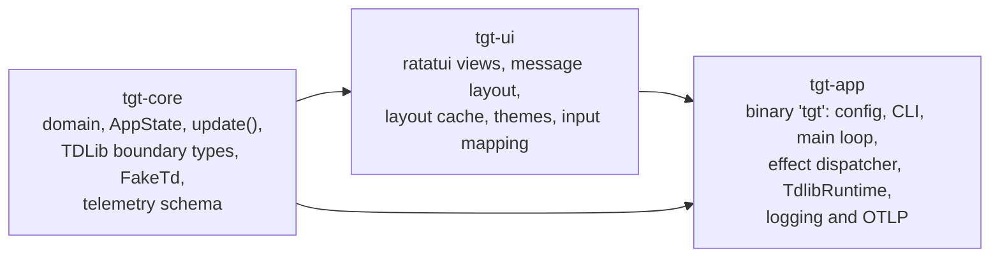
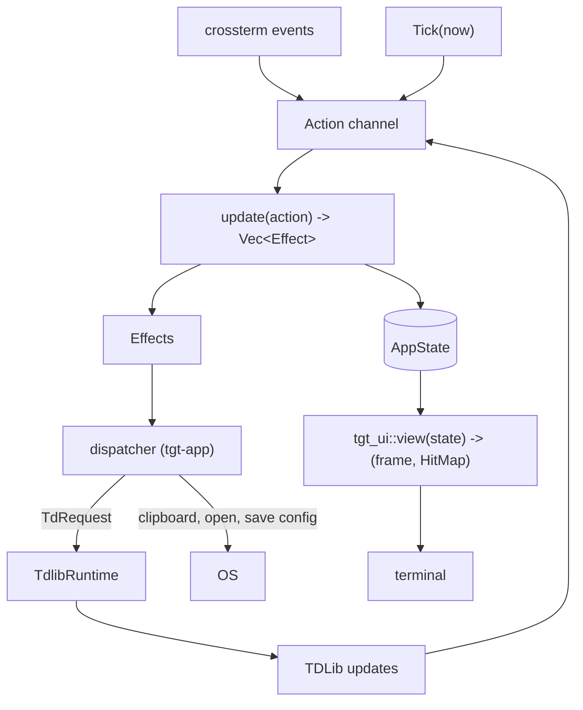

Three crates, one channel, and a function that isn't allowed to do anything. That constraint is the source of most of the non-obvious design in the codebase, and this page is about what it buys and what it costs.

## Three crates with an enforced direction



Two rules, and a shell script in CI that greps `cargo tree` and fails the build if either breaks: `tgt-core` must not depend on `ratatui` or `crossterm`, and `tgt-ui` must not depend on `tdlib-rs`.

Those bans are what make the two halves independently testable. The domain has no terminal, so it can be exercised without one. The renderer has no network, so a snapshot test of a message layout can't accidentally require an account.

## One channel, one owner

Every input becomes an `Action` on a single `tokio::sync::mpsc` channel: keystrokes, mouse events, TDLib updates, download progress, paste, resize, and a periodic tick. One task owns `AppState`. There are no locks, no `Arc<RwLock<AppState>>`, and no second writer.



The signature is the whole contract:

```rust
pub fn update(&mut self, action: Action) -> Vec<Effect>;
```

It mutates memory and returns *descriptions* of side effects. No I/O, no spawning, no clock, no randomness. Time enters as `Action::Tick { now }`. Randomness (the install id, the HMAC salt) is generated in `tgt-app` at boot and handed in as plain data.

Replay a scripted list of actions and you get a deterministic state, every time, with no network and no account. Which is exactly what the integration tests do.

## What purity costs

Three things in the client genuinely can't be computed purely, and the resolution is the same pattern each time: resolve it at the boundary, hand core semantic data.

**Mouse coordinates.** Core has no idea how anything was drawn, so it can't map column 43, row 7 to a chat row. The view records a hit map while drawing and returns it alongside the frame; the runtime resolves the coordinate; core receives `Action::Click { target: HitTarget::ChatRow(id) }`. Core never sees a coordinate.

**Filesystem checks.** Whether `/send ~/photo.jpg` names a real file, and what `~` expands to, is I/O. Core keeps only a pure `looks_like_path` heuristic and pushes a confirmation modal; `tgt-app` resolves and validates the path when the effect is dispatched.

**The TDLib database key.** `SetTdlibParameters` carries a key read from the OS credential store, which core cannot touch. So the auth state machine deliberately emits *nothing* for the `WaitTdlibParameters` phase, and the dispatcher issues that one request itself. It's the single documented impure exception in the update flow, and it's called out as such in the code rather than quietly done.

## Routing: first claimant wins

`app.rs` is a thin router. A key is offered to layers in a fixed order, and the first one to claim it stops propagation:

1. Quit binding, checked above everything, so a half-finished login is still quittable
2. The consent screen, which claims every key while it's up
3. A modal, if one is open
4. The auth screen
5. <kbd>Esc</kbd>
6. The focused pane
7. Conversation scrolling, but only from the composer or selection mode
8. Pane movement
9. The palette binding
10. The help binding
11. Global <kbd>/</kbd>, and only from selection mode

Handlers return `Option<Vec<Effect>>`: `None` means "I didn't claim this", and the router keeps walking.

Notice where <kbd>Esc</kbd> sits: fourth, above the panes. That's deliberate. Every focus-stack transition lives in the router and nowhere else, and handlers are forbidden from touching `app.focus` themselves. The "one <kbd>Esc</kbd>, one level" guarantee isn't a convention that every handler has to remember; it's a property of there being exactly one piece of code that can pop.

The same centralisation applies to telemetry. Events are minted in the router, keyed off the effects a route produced, not in the handlers. So an unconfirmed delete dialog can't emit a `message.delete`, and two handlers can never disagree about what a user action is called.

## The TDLib boundary

Everything goes through one `TdRuntime` trait with two implementations.

`TdlibRuntime` is the only module in the workspace that imports `tdlib_rs`. Raw TDLib types, which are full of message bodies and phone numbers, die there and become `TdUpdate` / `TdResponse` values built from the fields the client actually uses. Nothing downstream can accidentally hold a raw PII-bearing struct, because nothing downstream can name the type.

`FakeTd` replays JSONL fixtures. Integration tests in `crates/app/tests/` drive the *real* runtime loop against it by `#[path]`-including the app modules, so the thing under test is the shipped code path rather than a parallel test harness. Effects dispatch through `tokio::spawn`, so those tests assert on state transitions or on what `FakeTd` received rather than reading state immediately after a step.

## Rendering

`tgt_ui::view(state)` draws a frame and returns a hit map. It's a pure function of state; there's no widget tree to keep in sync and no retained mode.

Message layout is cached, keyed on `(message_id, width, theme_generation, spoilers_revealed)`. Anything that changes without one of those changing (reactions, read receipts, download progress) has to render as per-frame lines *outside* the cached block. Getting that wrong shows up as a message whose reaction count never updates, which is why attachment lines render entirely per-frame.

Snapshot tests pin the output. They live in three places, they're the only thing keeping the visual design from drifting, and the review instruction is to read the diff before accepting.

## One more constraint worth knowing

Nothing writes to stdout or stderr while the TUI is active. Not a warning, not a parse error, not a failed theme load. All of it goes to the rolling log under `~/.local/state/telegram-tui/`. The panic hook restores the terminal (alternate screen, raw mode, mouse capture) *before* it prints anything, so a crash leaves you with a working shell and a readable backtrace rather than a scrambled one.

The single deliberate exception is the terminal alert escape sequence, which takes no content parameters at all.

## Going deeper

The engineering documents in the repo are the real contract, and they're linked from [Contributing](contributing.md). `docs/architecture.md` in particular is the inter-module contract: every shared type, handler signature, and dependency pin, plus the amendments discovered during implementation.
